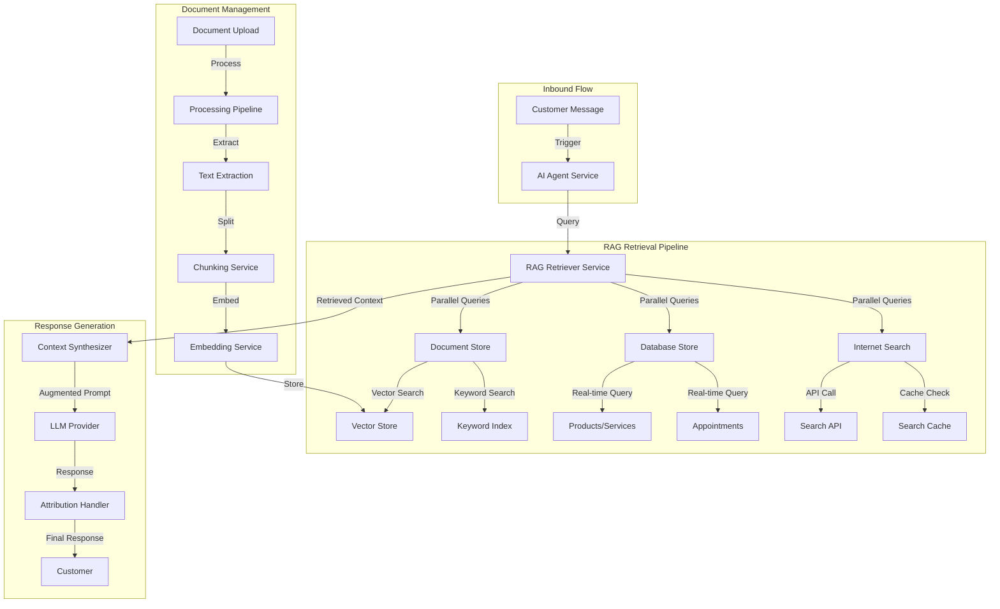

# Design Document

## Overview

This design document outlines the architecture for enhancing the Tulia AI AI customer service agent with comprehensive Retrieval-Augmented Generation (RAG) capabilities. The system will ground all agent responses in verifiable sources including tenant-uploaded documents (PDFs, text files), real-time database records (products, services, appointments), and internet-sourced product information.

The design leverages LangChain as the primary RAG framework for rapid MVP delivery while maintaining flexibility for future customization. The architecture ensures strict multi-tenant isolation, fast retrieval performance, and seamless integration with the existing AI agent infrastructure.

### Key Design Principles

1. **Source-Grounded Responses** - All information must come from verifiable sources
2. **Multi-Source Synthesis** - Combine documents, database, and internet seamlessly
3. **Tenant Isolation** - Complete data separation between tenants
4. **Performance First** - Sub-300ms retrieval for 95% of queries
5. **Framework Leverage** - Use LangChain for proven patterns
6. **Graceful Degradation** - Handle source failures without blocking responses
7. **Cost Optimization** - Balance quality with embedding and search costs

## Architecture

### High-Level Architecture



### Component Architecture

The RAG enhancement adds the following major components to the existing AI agent system:

1. **RAG Retriever Service** - Orchestrates retrieval from multiple sources
2. **Document Store** - Manages uploaded documents and vector search
3. **Vector Store Integration** - Pinecone/Weaviate/Qdrant for embeddings
4. **Database Store** - Real-time queries for products, services, appointments
5. **Internet Search Service** - Enriches sparse product information
6. **Document Processing Pipeline** - Ingests and indexes documents
7. **Embedding Service** - Generates embeddings for semantic search
8. **Context Synthesizer** - Combines information from multiple sources
9. **Attribution Handler** - Manages source citations in responses
10. **Hybrid Search Engine** - Combines semantic and keyword search

## Components and Interfaces

### 1. RAG Retriever Service

**Purpose:** Orchestrates retrieval from multiple knowledge sources and ranks results by relevance.

**Key Responsibilities:**
- Analyze query to determine relevant source types
- Execute parallel retrieval from documents, database, and internet
- Rank and filter results by relevance and confidence
- Synthesize information from multiple sources
- Track retrieval performance and success rates

**Interface:**
```python
class RAGRetrieverService:
    def retrieve(
        self,
        query: str,
        tenant: Tenant,
        conversation_context: Optional[Dict] = None,
        max_results: int = 5
    ) -> RetrievalResult:
        """Retrieve relevant information from all sources."""
        
    def retrieve_from_documents(
        self,
        query: str,
        tenant: Tenant,
        max_results: int = 3
    ) -> List[DocumentChunk]:
        """Retrieve from uploaded documents."""
        
    def retrieve_from_database(
        self,
        query: str,
        tenant: Tenant
    ) -> DatabaseContext:
        """Retrieve from products, services, appointments."""
        
    def retrieve_from_internet(
        self,
        query: str,
        product_name: Optional[str] = None
    ) -> List[InternetResult]:
        """Retrieve from internet search."""
        
    def rank_results(
        self,
        results: List[RetrievalSource],
        query: str
    ) -> List[RetrievalSource]:
        """Rank results by relevance."""
```

### 2. Document Store Service

**Purpose:** Manages document lifecycle including upload, processing, storage, and retrieval.

**Key Responsibilities:**
- Handle document uploads with validation
- Extract text from PDFs and text files
- Split documents into optimal chunks
- Generate and store embeddings
- Perform hybrid search (semantic + keyword)
- Manage document metadata and versioning

**Interface:**
```python
class DocumentStoreService:
    def upload_document(
        self,
        tenant: Tenant,
        file: UploadedFile,
        metadata: Optional[Dict] = None
    ) -> Document:
        """Upload and process document."""
        
    def search_documents(
        self,
        query: str,
        tenant: Tenant,
        search_type: str = 'hybrid',  # 'semantic', 'keyword', 'hybrid'
        max_results: int = 5
    ) -> List[DocumentChunk]:
        """Search documents using specified method."""
        
    def delete_document(
        self,
        document_id: UUID,
        tenant: Tenant
    ) -> bool:
        """Delete document and all embeddings."""
        
    def get_document_status(
        self,
        document_id: UUID
    ) -> DocumentStatus:
        """Get processing status of document."""
```


### 3. Vector Store Integration

**Purpose:** Provides abstraction layer for vector database operations with support for multiple providers.

**Key Responsibilities:**
- Abstract provider-specific APIs (Pinecone, Weaviate, Qdrant)
- Store and index embeddings with tenant isolation
- Perform semantic similarity search
- Handle vector store connection management
- Support batch operations for efficiency

**Interface:**
```python
class VectorStore(ABC):
    @abstractmethod
    def upsert(
        self,
        vectors: List[Vector],
        tenant_id: UUID,
        metadata: List[Dict]
    ) -> bool:
        """Insert or update vectors."""
        
    @abstractmethod
    def search(
        self,
        query_vector: Vector,
        tenant_id: UUID,
        top_k: int = 5,
        filter: Optional[Dict] = None
    ) -> List[VectorSearchResult]:
        """Search for similar vectors."""
        
    @abstractmethod
    def delete(
        self,
        ids: List[str],
        tenant_id: UUID
    ) -> bool:
        """Delete vectors by ID."""

class PineconeVectorStore(VectorStore):
    """Pinecone implementation."""
    
class WeaviateVectorStore(VectorStore):
    """Weaviate implementation."""
    
class QdrantVectorStore(VectorStore):
    """Qdrant implementation."""
```

### 4. Document Processing Pipeline

**Purpose:** Asynchronously processes uploaded documents for retrieval.

**Key Responsibilities:**
- Extract text from PDFs (with OCR fallback)
- Parse text files with encoding detection
- Split text into optimal chunks (300-500 tokens)
- Generate embeddings for each chunk
- Store chunks with metadata
- Handle processing errors gracefully

**Interface:**
```python
class DocumentProcessingPipeline:
    def process_document(
        self,
        document: Document,
        tenant: Tenant
    ) -> ProcessingResult:
        """Process document end-to-end."""
        
    def extract_text(
        self,
        file_path: str,
        file_type: str
    ) -> str:
        """Extract text from document."""
        
    def chunk_text(
        self,
        text: str,
        chunk_size: int = 400,
        overlap: int = 50
    ) -> List[TextChunk]:
        """Split text into chunks with overlap."""
        
    def generate_embeddings(
        self,
        chunks: List[TextChunk],
        model: str = 'text-embedding-3-small'
    ) -> List[Embedding]:
        """Generate embeddings for chunks."""
```

### 5. Embedding Service

**Purpose:** Generates embeddings for text using configurable models.

**Key Responsibilities:**
- Support multiple embedding models (OpenAI, sentence-transformers)
- Batch embedding generation for efficiency
- Cache embeddings to reduce costs
- Handle embedding model versioning
- Provide embedding dimension information

**Interface:**
```python
class EmbeddingService:
    def embed_text(
        self,
        text: str,
        model: str = 'text-embedding-3-small'
    ) -> Embedding:
        """Generate embedding for single text."""
        
    def embed_batch(
        self,
        texts: List[str],
        model: str = 'text-embedding-3-small'
    ) -> List[Embedding]:
        """Generate embeddings for batch of texts."""
        
    def get_model_info(
        self,
        model: str
    ) -> ModelInfo:
        """Get embedding model information."""
```


### 6. Database Store Service

**Purpose:** Retrieves real-time information from database for products, services, and appointments.

**Key Responsibilities:**
- Query products with current pricing and stock
- Query services with availability windows
- Query appointments for available slots
- Flag items with minimal descriptions for enrichment
- Cache frequently accessed data (1 minute TTL)

**Interface:**
```python
class DatabaseStoreService:
    def get_product_context(
        self,
        query: str,
        tenant: Tenant,
        max_results: int = 5
    ) -> List[ProductContext]:
        """Get relevant products from database."""
        
    def get_service_context(
        self,
        query: str,
        tenant: Tenant,
        max_results: int = 5
    ) -> List[ServiceContext]:
        """Get relevant services from database."""
        
    def get_appointment_availability(
        self,
        service_id: Optional[UUID],
        tenant: Tenant,
        date_range: Optional[Tuple[date, date]] = None
    ) -> List[AvailabilitySlot]:
        """Get available appointment slots."""
        
    def needs_enrichment(
        self,
        product: Product
    ) -> bool:
        """Check if product needs internet enrichment."""
```

### 7. Internet Search Service

**Purpose:** Enriches product information using internet search when descriptions are minimal.

**Key Responsibilities:**
- Integrate with search APIs (Google Custom Search, Bing)
- Construct effective search queries
- Extract relevant information from results
- Cache search results (24 hour TTL)
- Handle API failures gracefully

**Interface:**
```python
class InternetSearchService:
    def search_product_info(
        self,
        product_name: str,
        category: Optional[str] = None
    ) -> List[SearchResult]:
        """Search internet for product information."""
        
    def extract_product_details(
        self,
        search_results: List[SearchResult]
    ) -> ProductEnrichment:
        """Extract relevant product details from results."""
        
    def is_cached(
        self,
        query: str
    ) -> bool:
        """Check if search results are cached."""
        
    def get_cached_results(
        self,
        query: str
    ) -> Optional[List[SearchResult]]:
        """Get cached search results."""
```

### 8. Context Synthesizer

**Purpose:** Combines information from multiple sources into coherent context for LLM.

**Key Responsibilities:**
- Merge results from documents, database, and internet
- Resolve conflicts between sources
- Prioritize tenant-provided information
- Format context for LLM consumption
- Track source attribution

**Interface:**
```python
class ContextSynthesizer:
    def synthesize(
        self,
        retrieval_result: RetrievalResult,
        query: str,
        conversation_context: Optional[Dict] = None
    ) -> SynthesizedContext:
        """Synthesize information from multiple sources."""
        
    def resolve_conflicts(
        self,
        sources: List[RetrievalSource]
    ) -> List[RetrievalSource]:
        """Resolve conflicting information."""
        
    def format_for_llm(
        self,
        context: SynthesizedContext
    ) -> str:
        """Format context for LLM prompt."""
```

### 9. Attribution Handler

**Purpose:** Manages source citations in agent responses based on tenant configuration.

**Key Responsibilities:**
- Add source citations to responses
- Format citations appropriately
- Respect tenant attribution settings
- Track which sources were used
- Provide citation details for verification

**Interface:**
```python
class AttributionHandler:
    def add_attribution(
        self,
        response: str,
        sources: List[RetrievalSource],
        tenant_config: AgentConfiguration
    ) -> str:
        """Add source attribution to response."""
        
    def format_citation(
        self,
        source: RetrievalSource,
        citation_style: str = 'inline'  # 'inline', 'footnote', 'endnote'
    ) -> str:
        """Format individual citation."""
        
    def should_attribute(
        self,
        tenant_config: AgentConfiguration
    ) -> bool:
        """Check if attribution is enabled."""
```


### 10. Hybrid Search Engine

**Purpose:** Combines semantic and keyword search for optimal retrieval accuracy.

**Key Responsibilities:**
- Perform semantic search using embeddings
- Perform keyword search using BM25 or similar
- Merge and rank results from both methods
- Weight results based on query type
- Optimize for different query patterns

**Interface:**
```python
class HybridSearchEngine:
    def search(
        self,
        query: str,
        tenant: Tenant,
        semantic_weight: float = 0.7,
        keyword_weight: float = 0.3,
        max_results: int = 5
    ) -> List[SearchResult]:
        """Perform hybrid search."""
        
    def semantic_search(
        self,
        query: str,
        tenant: Tenant,
        max_results: int = 10
    ) -> List[SearchResult]:
        """Perform semantic search only."""
        
    def keyword_search(
        self,
        query: str,
        tenant: Tenant,
        max_results: int = 10
    ) -> List[SearchResult]:
        """Perform keyword search only."""
        
    def merge_results(
        self,
        semantic_results: List[SearchResult],
        keyword_results: List[SearchResult],
        semantic_weight: float,
        keyword_weight: float
    ) -> List[SearchResult]:
        """Merge and rank results."""
```

## Data Models

### Document Model

```python
class Document(BaseModel):
    """Uploaded document for RAG."""
    
    tenant = models.ForeignKey(
        'tenants.Tenant',
        on_delete=models.CASCADE,
        related_name='documents'
    )
    
    # File Information
    filename = models.CharField(max_length=255)
    file_type = models.CharField(
        max_length=20,
        choices=[
            ('pdf', 'PDF'),
            ('txt', 'Text'),
            ('docx', 'Word Document')
        ]
    )
    file_size = models.IntegerField()  # bytes
    file_path = models.CharField(max_length=500)
    
    # Processing Status
    status = models.CharField(
        max_length=20,
        choices=[
            ('pending', 'Pending'),
            ('processing', 'Processing'),
            ('completed', 'Completed'),
            ('failed', 'Failed')
        ],
        default='pending'
    )
    processing_error = models.TextField(blank=True)
    
    # Metadata
    title = models.CharField(max_length=255, blank=True)
    description = models.TextField(blank=True)
    category = models.CharField(max_length=100, blank=True)
    tags = models.JSONField(default=list)
    
    # Statistics
    chunk_count = models.IntegerField(default=0)
    total_tokens = models.IntegerField(default=0)
    
    # Timestamps
    uploaded_at = models.DateTimeField(auto_now_add=True)
    processed_at = models.DateTimeField(null=True, blank=True)
    
    class Meta:
        indexes = [
            models.Index(fields=['tenant', 'status']),
            models.Index(fields=['tenant', 'file_type']),
            models.Index(fields=['uploaded_at']),
        ]
```

### DocumentChunk Model

```python
class DocumentChunk(BaseModel):
    """Chunk of document for retrieval."""
    
    document = models.ForeignKey(
        'Document',
        on_delete=models.CASCADE,
        related_name='chunks'
    )
    
    tenant = models.ForeignKey(
        'tenants.Tenant',
        on_delete=models.CASCADE,
        related_name='document_chunks'
    )
    
    # Content
    content = models.TextField()
    chunk_index = models.IntegerField()
    token_count = models.IntegerField()
    
    # Embedding
    embedding_model = models.CharField(max_length=50)
    embedding_id = models.CharField(max_length=100)  # ID in vector store
    
    # Context
    page_number = models.IntegerField(null=True, blank=True)
    section_title = models.CharField(max_length=255, blank=True)
    
    # Metadata
    metadata = models.JSONField(default=dict)
    
    class Meta:
        indexes = [
            models.Index(fields=['document', 'chunk_index']),
            models.Index(fields=['tenant']),
            models.Index(fields=['embedding_id']),
        ]
        unique_together = [['document', 'chunk_index']]
```


### InternetSearchCache Model

```python
class InternetSearchCache(BaseModel):
    """Cache for internet search results."""
    
    # Query
    query_hash = models.CharField(max_length=64, unique=True)
    query_text = models.CharField(max_length=500)
    
    # Results
    results = models.JSONField()
    result_count = models.IntegerField()
    
    # Metadata
    search_provider = models.CharField(max_length=50)
    search_timestamp = models.DateTimeField(auto_now_add=True)
    
    # Expiration
    expires_at = models.DateTimeField()
    
    class Meta:
        indexes = [
            models.Index(fields=['query_hash']),
            models.Index(fields=['expires_at']),
        ]
```

### RAGRetrievalLog Model

```python
class RAGRetrievalLog(BaseModel):
    """Logs RAG retrieval operations for analytics."""
    
    conversation = models.ForeignKey(
        'messaging.Conversation',
        on_delete=models.CASCADE,
        related_name='rag_retrievals'
    )
    
    tenant = models.ForeignKey(
        'tenants.Tenant',
        on_delete=models.CASCADE,
        related_name='rag_retrievals'
    )
    
    # Query
    query = models.TextField()
    query_type = models.CharField(max_length=50)
    
    # Sources Used
    sources_queried = models.JSONField(default=list)  # ['documents', 'database', 'internet']
    sources_returned = models.JSONField(default=list)
    
    # Results
    document_results_count = models.IntegerField(default=0)
    database_results_count = models.IntegerField(default=0)
    internet_results_count = models.IntegerField(default=0)
    total_results = models.IntegerField(default=0)
    
    # Performance
    retrieval_time_ms = models.IntegerField()
    embedding_time_ms = models.IntegerField(default=0)
    
    # Success
    success = models.BooleanField(default=True)
    error_message = models.TextField(blank=True)
    
    class Meta:
        indexes = [
            models.Index(fields=['tenant', 'created_at']),
            models.Index(fields=['conversation']),
            models.Index(fields=['success']),
        ]
```

### AgentConfiguration Updates

```python
# Add to existing AgentConfiguration model:

class AgentConfiguration(BaseModel):
    # ... existing fields ...
    
    # RAG Configuration
    enable_document_retrieval = models.BooleanField(default=True)
    enable_database_retrieval = models.BooleanField(default=True)
    enable_internet_enrichment = models.BooleanField(default=False)
    enable_source_attribution = models.BooleanField(default=True)
    
    # Retrieval Settings
    max_document_results = models.IntegerField(default=3)
    max_database_results = models.IntegerField(default=5)
    max_internet_results = models.IntegerField(default=2)
    
    # Search Weights
    semantic_search_weight = models.FloatField(default=0.7)
    keyword_search_weight = models.FloatField(default=0.3)
    
    # Embedding Model
    embedding_model = models.CharField(
        max_length=50,
        default='text-embedding-3-small'
    )
    
    # Custom Instructions (NEW)
    agent_can_do = models.TextField(
        blank=True,
        help_text="Text instructions for what the agent CAN do"
    )
    agent_cannot_do = models.TextField(
        blank=True,
        help_text="Text instructions for what the agent CANNOT do"
    )
```

## LangChain Integration Strategy

### Why LangChain?

LangChain provides:
- **Document Loaders** - Pre-built loaders for PDFs, text files, etc.
- **Text Splitters** - Optimized chunking strategies
- **Vector Store Integrations** - Abstractions for Pinecone, Weaviate, Qdrant
- **Retrieval Chains** - Pre-built RAG patterns
- **Embeddings** - Support for OpenAI and open-source models
- **Proven Patterns** - Battle-tested RAG implementations

### LangChain Components to Use

1. **Document Loaders**
   - `PyPDFLoader` for PDF files
   - `TextLoader` for text files
   - Custom loaders for database content

2. **Text Splitters**
   - `RecursiveCharacterTextSplitter` for general text
   - Token-based splitting for context window management
   - Overlap configuration for context preservation

3. **Vector Stores**
   - `Pinecone` integration
   - `Weaviate` integration
   - `Qdrant` integration

4. **Embeddings**
   - `OpenAIEmbeddings` for OpenAI models
   - `HuggingFaceEmbeddings` for open-source models

5. **Retrievers**
   - `VectorStoreRetriever` for semantic search
   - `MultiQueryRetriever` for query expansion
   - `ContextualCompressionRetriever` for result filtering

### Custom Extensions

While leveraging LangChain, we'll build custom components for:
- **Multi-tenant isolation** - Tenant filtering in all queries
- **Hybrid search** - Combining semantic and keyword search
- **Database retrieval** - Real-time product/service queries
- **Internet search** - Product enrichment
- **Source attribution** - Citation management
- **Performance optimization** - Caching and batching


## Retrieval Pipeline Flow

### Query Processing Flow

```
1. Customer Message Received
   ↓
2. Query Analysis
   - Determine query type (product, service, general)
   - Extract entities (product names, dates, etc.)
   - Identify relevant sources
   ↓
3. Parallel Retrieval
   ├─→ Document Store (if relevant)
   │   ├─→ Semantic Search (vector store)
   │   ├─→ Keyword Search (BM25)
   │   └─→ Merge & Rank Results
   │
   ├─→ Database Store (if relevant)
   │   ├─→ Product Query
   │   ├─→ Service Query
   │   └─→ Appointment Query
   │
   └─→ Internet Search (if needed)
       ├─→ Check Cache
       ├─→ API Call (if not cached)
       └─→ Extract Relevant Info
   ↓
4. Result Synthesis
   - Merge results from all sources
   - Resolve conflicts (prioritize tenant data)
   - Rank by relevance
   - Format for LLM
   ↓
5. Context Augmentation
   - Add retrieved context to prompt
   - Include conversation history
   - Apply agent configuration
   ↓
6. LLM Generation
   - Generate response with context
   ↓
7. Attribution Handling
   - Add source citations (if enabled)
   - Format response
   ↓
8. Response Delivery
```

### Document Processing Flow

```
1. Document Upload
   ↓
2. Validation
   - Check file type (PDF, TXT)
   - Check file size (< 10MB)
   - Virus scan (optional)
   ↓
3. Text Extraction
   - PDF: PyPDF2 or pdfplumber
   - OCR fallback if needed
   - Text: encoding detection
   ↓
4. Text Chunking
   - Split into 300-500 token chunks
   - 50 token overlap
   - Preserve sentence boundaries
   ↓
5. Embedding Generation
   - Batch process chunks
   - Generate embeddings
   - Track progress
   ↓
6. Vector Store Indexing
   - Upsert to vector store
   - Include tenant_id in metadata
   - Store chunk references
   ↓
7. Database Storage
   - Save Document record
   - Save DocumentChunk records
   - Update status to 'completed'
   ↓
8. Notification
   - Notify tenant of completion
   - Make available for retrieval
```

## Hybrid Search Strategy

### Semantic Search (70% weight by default)

**When to prioritize:**
- Conceptual queries ("romantic perfume")
- Questions ("how do I book?")
- Descriptions ("something for dinner")

**Implementation:**
```python
# Generate query embedding
query_embedding = embedding_service.embed_text(query)

# Search vector store
results = vector_store.search(
    query_vector=query_embedding,
    tenant_id=tenant.id,
    top_k=10,
    filter={'tenant_id': str(tenant.id)}
)
```

### Keyword Search (30% weight by default)

**When to prioritize:**
- Specific terms ("SKU-12345")
- Product names ("iPhone 15 Pro")
- Exact phrases ("return policy")

**Implementation:**
```python
# Use BM25 or PostgreSQL full-text search
results = keyword_index.search(
    query=query,
    tenant_id=tenant.id,
    top_k=10
)
```

### Result Merging

```python
def merge_results(semantic_results, keyword_results, weights):
    # Normalize scores to 0-1 range
    semantic_normalized = normalize_scores(semantic_results)
    keyword_normalized = normalize_scores(keyword_results)
    
    # Combine with weights
    combined = {}
    for result in semantic_normalized:
        combined[result.id] = result.score * weights['semantic']
    
    for result in keyword_normalized:
        if result.id in combined:
            combined[result.id] += result.score * weights['keyword']
        else:
            combined[result.id] = result.score * weights['keyword']
    
    # Sort by combined score
    return sorted(combined.items(), key=lambda x: x[1], reverse=True)
```

## Internet Search Strategy

### When to Use Internet Search

1. **Product has minimal description** (< 50 characters)
2. **Product is a known brand/item** (books, perfumes, electronics)
3. **Customer asks for details** not in catalog
4. **Tenant has enabled** internet enrichment

### Search Query Construction

```python
def build_search_query(product: Product) -> str:
    """Build effective search query."""
    parts = []
    
    # Product name (required)
    parts.append(product.name)
    
    # Category (if available)
    if product.category:
        parts.append(product.category.name)
    
    # Brand (if available)
    if product.brand:
        parts.append(product.brand)
    
    # Add context terms
    parts.append("specifications")
    parts.append("features")
    
    return " ".join(parts)
```

### Result Extraction

```python
def extract_product_info(search_results: List[SearchResult]) -> ProductEnrichment:
    """Extract relevant information from search results."""
    
    # Use LLM to extract structured information
    prompt = f"""
    Extract product information from these search results:
    
    {format_search_results(search_results)}
    
    Extract:
    - Key features
    - Specifications
    - Use cases
    - Target audience
    
    Format as JSON.
    """
    
    extracted = llm.generate(prompt)
    return ProductEnrichment.from_json(extracted)
```

### Caching Strategy

- Cache search results for 24 hours
- Use query hash as cache key
- Invalidate on product update
- Track cache hit rate

## Source Attribution Formats

### Inline Citations (Default)

```
Our Premium Perfume collection includes Oriental Spice ($42) 
with warm, sensual notes perfect for evening occasions [Source: 
Product Catalog]. This fragrance features oud and amber base 
notes [Source: Internet - FragranceNet].
```

### Endnote Citations

```
Our Premium Perfume collection includes Oriental Spice ($42) 
with warm, sensual notes perfect for evening occasions. This 
fragrance features oud and amber base notes.

Sources:
1. Product Catalog - Oriental Spice product details
2. Internet (FragranceNet) - Fragrance composition details
```

### No Attribution (Tenant Disabled)

```
Our Premium Perfume collection includes Oriental Spice ($42) 
with warm, sensual notes perfect for evening occasions. This 
fragrance features oud and amber base notes.
```

## Performance Optimization

### Caching Strategy

1. **Embedding Cache**
   - Cache query embeddings (5 min TTL)
   - Cache document embeddings (permanent)
   - Use Redis for distributed cache

2. **Search Results Cache**
   - Cache vector search results (1 min TTL)
   - Cache database queries (1 min TTL)
   - Cache internet searches (24 hour TTL)

3. **Document Cache**
   - Cache frequently accessed chunks
   - Cache document metadata
   - Invalidate on updates

### Batch Processing

1. **Embedding Generation**
   - Batch up to 100 texts per API call
   - Process documents in background
   - Use Celery for async processing

2. **Vector Store Operations**
   - Batch upsert operations
   - Batch delete operations
   - Use connection pooling

### Query Optimization

1. **Parallel Retrieval**
   - Query all sources simultaneously
   - Use asyncio for concurrent operations
   - Set timeouts for each source

2. **Result Limiting**
   - Limit vector search to top 10
   - Limit database queries to top 5
   - Limit internet results to top 3

3. **Early Termination**
   - Stop if high-confidence results found
   - Skip internet search if database sufficient
   - Use confidence thresholds


## Multi-Tenant Isolation

### Vector Store Isolation

**Strategy 1: Tenant Namespaces (Recommended for Pinecone)**
```python
# Use tenant ID as namespace
namespace = f"tenant_{tenant.id}"
vector_store.upsert(vectors, namespace=namespace)
vector_store.search(query_vector, namespace=namespace)
```

**Strategy 2: Metadata Filtering (Recommended for Weaviate/Qdrant)**
```python
# Include tenant_id in metadata
metadata = {
    'tenant_id': str(tenant.id),
    'document_id': str(document.id),
    'chunk_index': chunk_index
}

# Filter by tenant_id in queries
results = vector_store.search(
    query_vector,
    filter={'tenant_id': str(tenant.id)}
)
```

### Database Isolation

All queries MUST include tenant filter:
```python
# CORRECT
chunks = DocumentChunk.objects.filter(
    tenant=tenant,
    document__status='completed'
)

# WRONG - Security vulnerability!
chunks = DocumentChunk.objects.all()
```

### File Storage Isolation

```python
# Store files in tenant-specific directories
file_path = f"documents/{tenant.id}/{document.id}/{filename}"

# Validate tenant ownership before access
def get_document(document_id, tenant):
    document = Document.objects.get(id=document_id)
    if document.tenant_id != tenant.id:
        raise PermissionDenied("Access denied")
    return document
```

## Error Handling

### Document Processing Errors

```python
try:
    text = extract_text(file_path)
except PDFError as e:
    # Try OCR fallback
    text = ocr_extract(file_path)
except Exception as e:
    # Mark document as failed
    document.status = 'failed'
    document.processing_error = str(e)
    document.save()
    # Notify tenant
    notify_processing_failure(document, e)
```

### Retrieval Errors

```python
try:
    results = retrieve_from_all_sources(query, tenant)
except VectorStoreError as e:
    # Fall back to keyword search only
    results = keyword_search(query, tenant)
    log_error("Vector store unavailable", e)
except DatabaseError as e:
    # Continue with document results only
    results = document_results
    log_error("Database unavailable", e)
except Exception as e:
    # Return empty results, don't block response
    results = []
    log_error("Retrieval failed", e)
```

### Internet Search Errors

```python
try:
    search_results = internet_search(query)
except APIError as e:
    # Skip internet enrichment
    log_warning("Internet search failed", e)
    search_results = []
except RateLimitError as e:
    # Use cached results if available
    search_results = get_cached_results(query) or []
```

## Testing Strategy

### Unit Tests

1. **Document Processing**
   - Test PDF text extraction
   - Test text chunking with overlap
   - Test embedding generation
   - Test error handling

2. **Retrieval Services**
   - Test semantic search
   - Test keyword search
   - Test hybrid search merging
   - Test result ranking

3. **Source Synthesis**
   - Test conflict resolution
   - Test source prioritization
   - Test context formatting

4. **Attribution**
   - Test citation formatting
   - Test attribution toggle
   - Test source tracking

### Integration Tests

1. **End-to-End Document Flow**
   - Upload document
   - Process and index
   - Search and retrieve
   - Verify results

2. **Multi-Source Retrieval**
   - Query all sources
   - Verify parallel execution
   - Verify result merging
   - Verify attribution

3. **Tenant Isolation**
   - Create documents for multiple tenants
   - Verify no cross-tenant access
   - Verify namespace isolation

### Performance Tests

1. **Retrieval Speed**
   - Measure vector search latency
   - Measure database query latency
   - Measure internet search latency
   - Verify 95th percentile < 300ms

2. **Document Processing**
   - Test large PDF processing (100+ pages)
   - Test batch embedding generation
   - Measure throughput

3. **Concurrent Load**
   - Multiple tenants querying simultaneously
   - Multiple documents processing simultaneously
   - Verify no performance degradation

## Demo Data Strategy

### Sample Documents

1. **Business FAQ Document** (PDF)
   - 20 common questions and answers
   - Covers products, services, policies
   - Multiple pages with sections

2. **Product Catalog Guide** (PDF)
   - Detailed product descriptions
   - Usage instructions
   - Care and maintenance

3. **Business Policies** (Text)
   - Return policy
   - Shipping policy
   - Privacy policy
   - Terms of service

4. **Service Guide** (PDF)
   - Service descriptions
   - Booking instructions
   - Pricing tiers

### Sample Products

1. **Well-Described Products**
   - Full descriptions (200+ chars)
   - Complete specifications
   - Clear use cases

2. **Minimally-Described Products**
   - Short descriptions (< 50 chars)
   - Missing specifications
   - Triggers internet enrichment

3. **Brand Products**
   - Known brands (books, perfumes)
   - Specific model numbers
   - Good for internet search testing

### Sample Conversations

1. **Document-Based Query**
   - "What is your return policy?"
   - Should retrieve from policy document

2. **Product Query**
   - "Tell me about the Oriental Spice perfume"
   - Should combine catalog + internet info

3. **Service Query**
   - "What services do you offer?"
   - Should retrieve from database

4. **Appointment Query**
   - "When can I book a massage?"
   - Should query real-time availability

5. **Multi-Source Query**
   - "I want a romantic perfume, what do you recommend?"
   - Should use documents, database, and internet

### Sample Agent Configurations

1. **Full Attribution Enabled**
   - Shows all source citations
   - Inline citation style

2. **Attribution Disabled**
   - Clean responses without citations
   - Still uses RAG internally

3. **Internet Enrichment Enabled**
   - Automatically enriches sparse products
   - Shows external sources

4. **Internet Enrichment Disabled**
   - Only uses tenant-provided data
   - More conservative approach

## Migration and Rollout

### Phase 1: Infrastructure Setup

1. Set up vector store (Pinecone/Weaviate/Qdrant)
2. Install LangChain and dependencies
3. Create database models and migrations
4. Set up file storage for documents

### Phase 2: Document Management

1. Implement document upload API
2. Build processing pipeline
3. Integrate embedding service
4. Test with sample documents

### Phase 3: Retrieval Integration

1. Implement RAG retriever service
2. Integrate with existing AI agent
3. Add database store service
4. Test retrieval accuracy

### Phase 4: Internet Enrichment

1. Integrate search API
2. Implement caching
3. Add enrichment logic
4. Test with sparse products

### Phase 5: Attribution and Polish

1. Implement attribution handler
2. Add tenant configuration options
3. Build analytics dashboard
4. Performance optimization

### Phase 6: Gradual Rollout

1. Enable for demo tenant
2. Enable for beta tenants (5-10)
3. Monitor performance and accuracy
4. Gradual rollout to all tenants

## Cost Estimation

### Embedding Costs (OpenAI text-embedding-3-small)

- **Cost**: $0.02 per 1M tokens
- **Average document**: 10,000 tokens = $0.0002
- **100 documents**: $0.02
- **Query embedding**: ~100 tokens = $0.000002

### Vector Store Costs (Pinecone)

- **Starter**: $70/month (100K vectors, 1 pod)
- **Standard**: $0.096/hour per pod
- **Storage**: Included in pod cost

### Internet Search Costs (Google Custom Search)

- **Free tier**: 100 queries/day
- **Paid**: $5 per 1,000 queries
- **With caching**: ~10-20 queries/day per tenant

### Monthly Cost Projections

**Small Tenant (10 documents, 100 conversations/month):**
- Embeddings: $0.02
- Vector store: $2.33 (shared pod)
- Internet search: $0 (free tier)
- **Total**: ~$2.35/month

**Medium Tenant (100 documents, 1,000 conversations/month):**
- Embeddings: $0.20
- Vector store: $2.33 (shared pod)
- Internet search: $1.50
- **Total**: ~$4.03/month

**Large Tenant (1,000 documents, 10,000 conversations/month):**
- Embeddings: $2.00
- Vector store: $7.00 (dedicated pod)
- Internet search: $15.00
- **Total**: ~$24/month

## Security Considerations

### Document Security

- Encrypt documents at rest
- Validate file types and sizes
- Scan for malware (optional)
- Secure file storage with access controls

### API Key Security

- Encrypt vector store API keys
- Encrypt search API keys
- Rotate keys regularly
- Use environment variables

### Query Security

- Sanitize all user inputs
- Prevent prompt injection
- Rate limit queries per tenant
- Log all retrieval operations

### Data Privacy

- GDPR compliance for document storage
- Right to deletion (remove documents + embeddings)
- Data retention policies
- Audit logging

## Monitoring and Observability

### Metrics to Track

1. **Retrieval Performance**
   - Average retrieval time
   - P95, P99 latency
   - Cache hit rate
   - Source success rate

2. **Document Processing**
   - Processing time per document
   - Success/failure rate
   - Queue depth
   - Embedding generation time

3. **Search Quality**
   - Retrieval success rate
   - Average relevance score
   - No-results rate
   - Source distribution

4. **Cost Tracking**
   - Embedding API costs
   - Vector store costs
   - Internet search costs
   - Total cost per tenant

### Alerts

- Retrieval latency > 500ms
- Document processing failures > 10%
- Vector store unavailable
- Internet search API failures
- Cost exceeds budget threshold

## Future Enhancements

1. **Advanced Retrieval**
   - Query expansion with synonyms
   - Multi-hop reasoning
   - Contextual re-ranking
   - Semantic caching

2. **Additional Sources**
   - Website scraping
   - Social media integration
   - CRM data integration
   - Email history

3. **Improved Processing**
   - Table extraction from PDFs
   - Image text extraction (OCR)
   - Video transcription
   - Audio transcription

4. **Better Search**
   - Graph-based retrieval
   - Temporal awareness
   - Personalized ranking
   - Federated search

5. **Analytics**
   - Knowledge gap analysis
   - Source quality scoring
   - Retrieval pattern analysis
   - A/B testing for retrieval strategies
