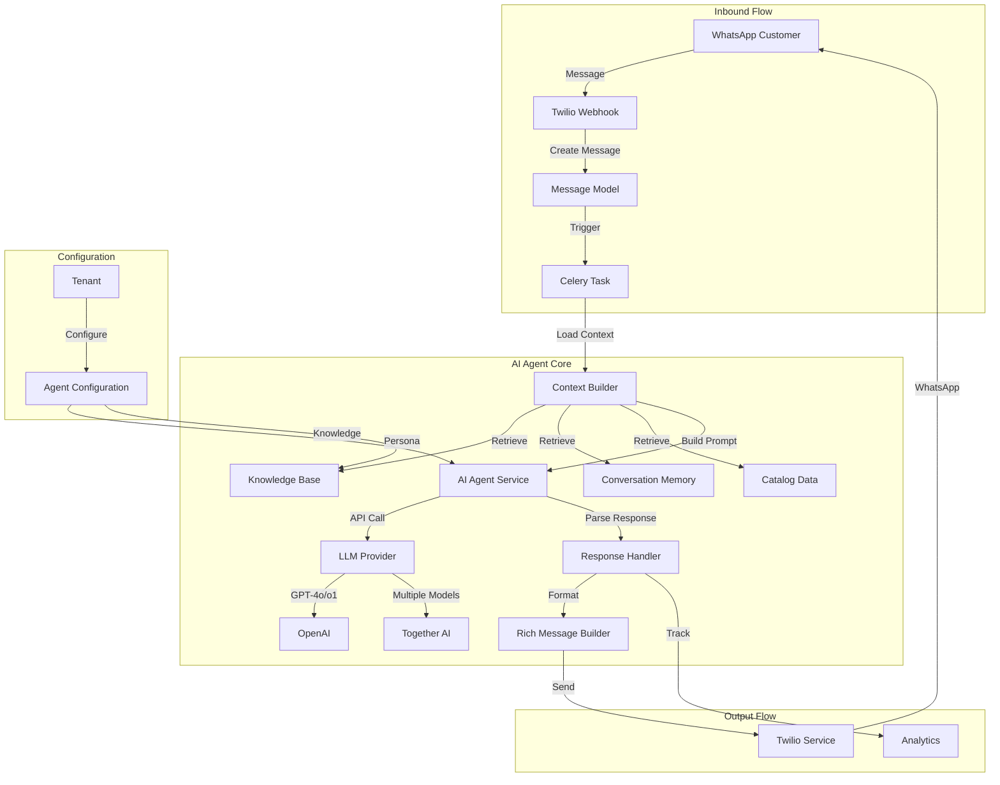

# Design Document

## Overview

This design document outlines the architecture for upgrading the Tulia AI bot from a basic intent classification system to an advanced AI-powered customer service agent. The enhanced system will leverage state-of-the-art language models, maintain comprehensive conversation memory, integrate tenant-specific knowledge bases, and provide rich interactive experiences through WhatsApp's advanced messaging features.

The design follows a modular, service-oriented architecture that maintains strict multi-tenant isolation while enabling powerful AI capabilities including context-aware responses, intelligent error correction, multi-intent handling, and proactive recommendations.

## Architecture

### High-Level Architecture



### Component Architecture

The system is organized into the following major components:

1. **AI Agent Service** - Core orchestration and LLM interaction
2. **Context Builder** - Assembles conversation context from multiple sources
3. **Knowledge Base Service** - Manages and retrieves tenant-specific knowledge
4. **Conversation Memory Service** - Maintains and retrieves conversation history
5. **LLM Provider Abstraction** - Unified interface for multiple AI models
6. **Rich Message Builder** - Constructs WhatsApp interactive messages
7. **Agent Configuration Service** - Manages tenant-specific agent settings
8. **Multi-Intent Processor** - Handles messages with multiple intents
9. **Fuzzy Matcher** - Intelligent matching for products, services, and queries

## Components and Interfaces

### 1. AI Agent Service

**Purpose:** Orchestrates the entire AI agent workflow from message receipt to response generation.

**Key Responsibilities:**
- Coordinate context building from multiple sources
- Select appropriate LLM model based on task complexity
- Generate responses using configured persona and knowledge
- Handle multi-intent messages
- Manage handoff decisions
- Track analytics and performance metrics

**Interface:**
```python
class AIAgentService:
    def process_message(
        self,
        message: Message,
        conversation: Conversation,
        tenant: Tenant
    ) -> AgentResponse:
        """Process customer message and generate response."""
        
    def generate_response(
        self,
        context: AgentContext,
        agent_config: AgentConfiguration
    ) -> AgentResponse:
        """Generate AI response with full context."""
        
    def should_handoff(
        self,
        response: AgentResponse,
        conversation: Conversation
    ) -> Tuple[bool, str]:
        """Determine if handoff is needed."""
```

### 2. Context Builder Service

**Purpose:** Assembles comprehensive context from conversation history, knowledge base, catalog, and customer data.

**Key Responsibilities:**
- Retrieve and prioritize conversation history
- Fetch relevant knowledge base entries
- Load product and service catalog data
- Include customer preferences and history
- Manage context window limits with intelligent truncation
- Cache frequently accessed context data

**Interface:**
```python
class ContextBuilderService:
    def build_context(
        self,
        conversation: Conversation,
        message: Message,
        tenant: Tenant
    ) -> AgentContext:
        """Build comprehensive context for AI agent."""
        
    def get_conversation_history(
        self,
        conversation: Conversation,
        max_messages: int = 20
    ) -> List[Message]:
        """Retrieve relevant conversation history."""
        
    def get_relevant_knowledge(
        self,
        query: str,
        tenant: Tenant,
        limit: int = 5
    ) -> List[KnowledgeEntry]:
        """Retrieve relevant knowledge base entries."""
        
    def get_catalog_context(
        self,
        tenant: Tenant,
        query: Optional[str] = None
    ) -> CatalogContext:
        """Get product and service catalog context."""
```

### 3. Knowledge Base Service

**Purpose:** Manages tenant-specific knowledge including FAQs, policies, and custom instructions.

**Key Responsibilities:**
- Store and index knowledge base entries
- Perform semantic search for relevant entries
- Support multiple entry types (FAQ, policy, instruction)
- Handle knowledge base updates and versioning
- Provide conflict detection and resolution

**Interface:**
```python
class KnowledgeBaseService:
    def create_entry(
        self,
        tenant: Tenant,
        entry_type: str,
        content: Dict[str, Any]
    ) -> KnowledgeEntry:
        """Create new knowledge base entry."""
        
    def search(
        self,
        tenant: Tenant,
        query: str,
        entry_types: Optional[List[str]] = None,
        limit: int = 5
    ) -> List[KnowledgeEntry]:
        """Search knowledge base using semantic similarity."""
        
    def update_entry(
        self,
        entry_id: UUID,
        content: Dict[str, Any]
    ) -> KnowledgeEntry:
        """Update existing knowledge entry."""
```


### 4. LLM Provider Abstraction

**Purpose:** Provides unified interface for multiple AI model providers (OpenAI, Together AI, future providers).

**Key Responsibilities:**
- Abstract provider-specific API differences
- Handle authentication and rate limiting
- Implement fallback strategies
- Track token usage and costs
- Support streaming responses
- Normalize responses across providers

**Interface:**
```python
class LLMProvider(ABC):
    @abstractmethod
    def generate(
        self,
        messages: List[Dict[str, str]],
        model: str,
        temperature: float = 0.7,
        max_tokens: int = 1000
    ) -> LLMResponse:
        """Generate completion from LLM."""
        
    @abstractmethod
    def get_available_models(self) -> List[ModelInfo]:
        """Get list of available models."""

class OpenAIProvider(LLMProvider):
    """OpenAI implementation supporting GPT-4o, o1-preview, o1-mini."""
    
class TogetherAIProvider(LLMProvider):
    """Together AI implementation for multiple model access."""

class LLMProviderFactory:
    def get_provider(self, provider_name: str) -> LLMProvider:
        """Get provider instance by name."""
```

### 5. Rich Message Builder

**Purpose:** Constructs WhatsApp interactive messages with buttons, lists, images, and media.

**Key Responsibilities:**
- Build interactive button messages
- Create list messages for selections
- Format product/service cards with images
- Handle media attachments (images, videos, documents)
- Validate message structure against WhatsApp limits
- Generate fallback text for unsupported clients

**Interface:**
```python
class RichMessageBuilder:
    def build_product_card(
        self,
        product: Product,
        actions: List[str] = ['buy', 'details']
    ) -> WhatsAppMessage:
        """Build product card with image and action buttons."""
        
    def build_service_card(
        self,
        service: Service,
        actions: List[str] = ['book', 'availability']
    ) -> WhatsAppMessage:
        """Build service card with image and action buttons."""
        
    def build_list_message(
        self,
        title: str,
        items: List[Dict[str, Any]],
        button_text: str = "Select"
    ) -> WhatsAppMessage:
        """Build interactive list message."""
        
    def build_button_message(
        self,
        text: str,
        buttons: List[Dict[str, str]]
    ) -> WhatsAppMessage:
        """Build message with quick reply buttons."""
```

### 6. Agent Configuration Service

**Purpose:** Manages tenant-specific agent configuration including persona, behavior, and model selection.

**Key Responsibilities:**
- Store and retrieve agent configuration
- Validate configuration settings
- Apply persona to prompts
- Manage behavioral restrictions
- Handle configuration versioning

**Interface:**
```python
class AgentConfigurationService:
    def get_configuration(self, tenant: Tenant) -> AgentConfiguration:
        """Get agent configuration for tenant."""
        
    def update_configuration(
        self,
        tenant: Tenant,
        config: Dict[str, Any]
    ) -> AgentConfiguration:
        """Update agent configuration."""
        
    def apply_persona(
        self,
        base_prompt: str,
        config: AgentConfiguration
    ) -> str:
        """Apply persona settings to prompt."""
```

### 7. Multi-Intent Processor

**Purpose:** Identifies and handles messages containing multiple intents or rapid message bursts.

**Key Responsibilities:**
- Detect multiple intents in single message
- Queue and process rapid message sequences
- Maintain context across message bursts
- Prioritize intents based on urgency
- Generate structured responses addressing all intents

**Interface:**
```python
class MultiIntentProcessor:
    def detect_intents(
        self,
        message: str,
        context: AgentContext
    ) -> List[Intent]:
        """Detect all intents in message."""
        
    def process_message_burst(
        self,
        messages: List[Message],
        conversation: Conversation
    ) -> AgentResponse:
        """Process multiple messages as single context."""
        
    def prioritize_intents(
        self,
        intents: List[Intent]
    ) -> List[Intent]:
        """Order intents by priority and logical flow."""
```

### 8. Fuzzy Matcher Service

**Purpose:** Provides intelligent matching for products, services, and queries with spelling correction.

**Key Responsibilities:**
- Perform fuzzy string matching
- Correct common spelling errors
- Use semantic similarity for matching
- Handle abbreviations and informal names
- Suggest alternatives when no exact match

**Interface:**
```python
class FuzzyMatcherService:
    def match_product(
        self,
        query: str,
        tenant: Tenant,
        threshold: float = 0.7
    ) -> List[Tuple[Product, float]]:
        """Match query to products with confidence scores."""
        
    def match_service(
        self,
        query: str,
        tenant: Tenant,
        threshold: float = 0.7
    ) -> List[Tuple[Service, float]]:
        """Match query to services with confidence scores."""
        
    def correct_spelling(
        self,
        text: str,
        vocabulary: List[str]
    ) -> str:
        """Correct spelling using vocabulary."""
```

### 9. Catalog Browser Service

**Purpose:** Manages pagination and browsing of large product and service catalogs.

**Key Responsibilities:**
- Paginate catalog results (5 items per page)
- Maintain browsing session state
- Handle navigation (next, previous, search)
- Track current position in catalog
- Filter and sort results

**Interface:**
```python
class CatalogBrowserService:
    def start_browse_session(
        self,
        conversation: Conversation,
        catalog_type: str,  # 'products' or 'services'
        filters: Optional[Dict] = None
    ) -> BrowseSession:
        """Start new browsing session."""
        
    def get_page(
        self,
        session: BrowseSession,
        page_number: int
    ) -> CatalogPage:
        """Get specific page of results."""
        
    def next_page(
        self,
        session: BrowseSession
    ) -> CatalogPage:
        """Get next page of results."""
        
    def previous_page(
        self,
        session: BrowseSession
    ) -> CatalogPage:
        """Get previous page of results."""
        
    def apply_filters(
        self,
        session: BrowseSession,
        filters: Dict
    ) -> BrowseSession:
        """Apply filters to browsing session."""
```

### 10. Reference Context Manager

**Purpose:** Maintains context of recently displayed lists to resolve positional references like "1" or "first".

**Key Responsibilities:**
- Store recently displayed lists with timestamps
- Resolve numeric and ordinal references
- Handle ambiguous references
- Expire old contexts (5 minutes)
- Support multiple list types (products, services, options)

**Interface:**
```python
class ReferenceContextManager:
    def store_list_context(
        self,
        conversation: Conversation,
        items: List[Any],
        list_type: str,
        expires_in_seconds: int = 300
    ) -> str:
        """Store list context and return context ID."""
        
    def resolve_reference(
        self,
        conversation: Conversation,
        reference: str  # "1", "first", "the second one", etc.
    ) -> Optional[Any]:
        """Resolve reference to actual item."""
        
    def get_current_list(
        self,
        conversation: Conversation
    ) -> Optional[List[Any]]:
        """Get most recent list context."""
        
    def clear_context(
        self,
        conversation: Conversation
    ) -> None:
        """Clear reference context."""
```

### 11. Product Intelligence Service

**Purpose:** Uses AI to understand product/service characteristics and make intelligent recommendations.

**Key Responsibilities:**
- Analyze product descriptions with AI
- Extract key features and characteristics
- Match customer needs to products semantically
- Generate product summaries
- Identify distinguishing features

**Interface:**
```python
class ProductIntelligenceService:
    def analyze_product(
        self,
        product: Product
    ) -> ProductAnalysis:
        """Analyze product using AI to extract characteristics."""
        
    def match_need_to_products(
        self,
        customer_need: str,
        tenant: Tenant,
        limit: int = 5
    ) -> List[Tuple[Product, str]]:
        """Match customer need to products with explanations."""
        
    def generate_recommendation_explanation(
        self,
        product: Product,
        customer_context: str
    ) -> str:
        """Generate explanation for why product matches need."""
        
    def extract_distinguishing_features(
        self,
        products: List[Product]
    ) -> Dict[UUID, List[str]]:
        """Extract features that distinguish products from each other."""
```

### 12. Discovery and Narrowing Service

**Purpose:** Guides customers through discovery by asking clarifying questions and narrowing options.

**Key Responsibilities:**
- Identify when clarification is needed
- Generate relevant clarifying questions
- Filter catalog based on preferences
- Track narrowing session state
- Suggest alternatives when no matches

**Interface:**
```python
class DiscoveryService:
    def should_ask_clarifying_questions(
        self,
        query: str,
        result_count: int
    ) -> bool:
        """Determine if clarification would help."""
        
    def generate_clarifying_questions(
        self,
        query: str,
        catalog_items: List[Any]
    ) -> List[str]:
        """Generate relevant questions to narrow options."""
        
    def apply_preferences(
        self,
        items: List[Any],
        preferences: Dict[str, Any]
    ) -> List[Any]:
        """Filter items based on stated preferences."""
        
    def suggest_alternatives(
        self,
        original_query: str,
        tenant: Tenant
    ) -> List[Tuple[Any, str]]:
        """Suggest alternatives with difference explanations."""
```

### 13. Multi-Language Processor

**Purpose:** Handles multi-language messages including English, Swahili, and Sheng code-switching.

**Key Responsibilities:**
- Detect languages in mixed messages
- Translate Swahili/Sheng to English for processing
- Maintain language preference per customer
- Handle common Swahili/Sheng phrases
- Generate responses in customer's preferred language

**Interface:**
```python
class MultiLanguageProcessor:
    def detect_languages(
        self,
        message: str
    ) -> List[str]:
        """Detect all languages in message."""
        
    def normalize_message(
        self,
        message: str
    ) -> str:
        """Normalize mixed-language message to English."""
        
    def translate_common_phrases(
        self,
        message: str
    ) -> str:
        """Translate common Swahili/Sheng phrases."""
        
    def get_customer_language_preference(
        self,
        conversation: Conversation
    ) -> str:
        """Determine customer's preferred language."""
        
    def format_response_in_language(
        self,
        response: str,
        target_language: str
    ) -> str:
        """Format response in target language."""
```

## Data Models

### AgentConfiguration Model

```python
class AgentConfiguration(BaseModel):
    """Tenant-specific agent configuration."""
    
    tenant = models.OneToOneField(
        'tenants.Tenant',
        on_delete=models.CASCADE,
        related_name='agent_configuration'
    )
    
    # Persona
    agent_name = models.CharField(max_length=100, default="Assistant")
    personality_traits = models.JSONField(default=dict)
    tone = models.CharField(
        max_length=20,
        choices=[
            ('professional', 'Professional'),
            ('friendly', 'Friendly'),
            ('casual', 'Casual'),
            ('formal', 'Formal')
        ],
        default='friendly'
    )
    
    # Model Configuration
    default_model = models.CharField(max_length=50, default='gpt-4o')
    fallback_models = models.JSONField(default=list)
    temperature = models.FloatField(default=0.7)
    
    # Behavior
    max_response_length = models.IntegerField(default=500)
    behavioral_restrictions = models.JSONField(default=list)
    required_disclaimers = models.JSONField(default=list)
    
    # Handoff Configuration
    confidence_threshold = models.FloatField(default=0.7)
    auto_handoff_topics = models.JSONField(default=list)
    max_low_confidence_attempts = models.IntegerField(default=2)
    
    # Features
    enable_proactive_suggestions = models.BooleanField(default=True)
    enable_spelling_correction = models.BooleanField(default=True)
    enable_rich_messages = models.BooleanField(default=True)
```


### KnowledgeEntry Model

```python
class KnowledgeEntry(BaseModel):
    """Tenant-specific knowledge base entry."""
    
    tenant = models.ForeignKey(
        'tenants.Tenant',
        on_delete=models.CASCADE,
        related_name='knowledge_entries'
    )
    
    entry_type = models.CharField(
        max_length=20,
        choices=[
            ('faq', 'FAQ'),
            ('policy', 'Policy'),
            ('instruction', 'Instruction'),
            ('location', 'Location'),
            ('hours', 'Operating Hours')
        ]
    )
    
    # Content
    title = models.CharField(max_length=200)
    content = models.TextField()
    metadata = models.JSONField(default=dict)
    
    # Search
    embedding = models.JSONField(null=True, blank=True)
    keywords = models.JSONField(default=list)
    
    # Organization
    category = models.CharField(max_length=100, blank=True)
    priority = models.IntegerField(default=0)
    
    # Status
    is_active = models.BooleanField(default=True)
    version = models.IntegerField(default=1)
    
    class Meta:
        indexes = [
            models.Index(fields=['tenant', 'entry_type', 'is_active']),
            models.Index(fields=['tenant', 'category']),
        ]
```

### ConversationContext Model

```python
class ConversationContext(BaseModel):
    """Stores conversation context for memory."""
    
    conversation = models.ForeignKey(
        'messaging.Conversation',
        on_delete=models.CASCADE,
        related_name='contexts'
    )
    
    # Context Data
    current_topic = models.CharField(max_length=100, blank=True)
    pending_action = models.CharField(max_length=100, blank=True)
    extracted_entities = models.JSONField(default=dict)
    
    # State
    last_product_viewed = models.ForeignKey(
        'catalog.Product',
        on_delete=models.SET_NULL,
        null=True,
        blank=True
    )
    last_service_viewed = models.ForeignKey(
        'services.Service',
        on_delete=models.SET_NULL,
        null=True,
        blank=True
    )
    
    # Memory
    conversation_summary = models.TextField(blank=True)
    key_facts = models.JSONField(default=list)
    
    # Timing
    last_interaction = models.DateTimeField(auto_now=True)
    context_expires_at = models.DateTimeField(null=True, blank=True)
```

### AgentInteraction Model

```python
class AgentInteraction(BaseModel):
    """Tracks AI agent interactions for analytics."""
    
    conversation = models.ForeignKey(
        'messaging.Conversation',
        on_delete=models.CASCADE,
        related_name='agent_interactions'
    )
    
    # Input
    customer_message = models.TextField()
    detected_intents = models.JSONField(default=list)
    
    # Processing
    model_used = models.CharField(max_length=50)
    context_size = models.IntegerField()
    processing_time_ms = models.IntegerField()
    
    # Output
    agent_response = models.TextField()
    confidence_score = models.FloatField()
    handoff_triggered = models.BooleanField(default=False)
    handoff_reason = models.CharField(max_length=100, blank=True)
    
    # Rich Message
    message_type = models.CharField(
        max_length=20,
        choices=[
            ('text', 'Text'),
            ('button', 'Button'),
            ('list', 'List'),
            ('media', 'Media')
        ],
        default='text'
    )
    
    # Metrics
    token_usage = models.JSONField(default=dict)
    estimated_cost = models.DecimalField(
        max_digits=10,
        decimal_places=6,
        default=0
    )
    
    class Meta:
        indexes = [
            models.Index(fields=['conversation', 'created_at']),
            models.Index(fields=['model_used', 'created_at']),
            models.Index(fields=['confidence_score']),
        ]
```

### MessageQueue Model

```python
class MessageQueue(BaseModel):
    """Queues messages for burst handling."""
    
    conversation = models.ForeignKey(
        'messaging.Conversation',
        on_delete=models.CASCADE,
        related_name='message_queue'
    )
    
    message = models.ForeignKey(
        'messaging.Message',
        on_delete=models.CASCADE
    )
    
    status = models.CharField(
        max_length=20,
        choices=[
            ('queued', 'Queued'),
            ('processing', 'Processing'),
            ('processed', 'Processed'),
            ('failed', 'Failed')
        ],
        default='queued'
    )
    
    queue_position = models.IntegerField()
    queued_at = models.DateTimeField(auto_now_add=True)
    processed_at = models.DateTimeField(null=True, blank=True)
    
    class Meta:
        indexes = [
            models.Index(fields=['conversation', 'status', 'queue_position']),
        ]
```

### BrowseSession Model

```python
class BrowseSession(BaseModel):
    """Tracks catalog browsing sessions."""
    
    conversation = models.ForeignKey(
        'messaging.Conversation',
        on_delete=models.CASCADE,
        related_name='browse_sessions'
    )
    
    catalog_type = models.CharField(
        max_length=20,
        choices=[
            ('products', 'Products'),
            ('services', 'Services')
        ]
    )
    
    # Pagination
    current_page = models.IntegerField(default=1)
    items_per_page = models.IntegerField(default=5)
    total_items = models.IntegerField()
    
    # Filters
    filters = models.JSONField(default=dict)
    search_query = models.CharField(max_length=200, blank=True)
    
    # State
    is_active = models.BooleanField(default=True)
    expires_at = models.DateTimeField()
    
    class Meta:
        indexes = [
            models.Index(fields=['conversation', 'is_active']),
            models.Index(fields=['expires_at']),
        ]
```

### ReferenceContext Model

```python
class ReferenceContext(BaseModel):
    """Stores list context for positional references."""
    
    conversation = models.ForeignKey(
        'messaging.Conversation',
        on_delete=models.CASCADE,
        related_name='reference_contexts'
    )
    
    list_type = models.CharField(
        max_length=20,
        choices=[
            ('products', 'Products'),
            ('services', 'Services'),
            ('options', 'Options')
        ]
    )
    
    # List items stored as JSON with IDs and display text
    items = models.JSONField()
    
    # Expiration
    expires_at = models.DateTimeField()
    
    # Metadata
    context_id = models.UUIDField(default=uuid.uuid4, unique=True)
    
    class Meta:
        indexes = [
            models.Index(fields=['conversation', 'expires_at']),
            models.Index(fields=['context_id']),
        ]
```

### ProductAnalysis Model

```python
class ProductAnalysis(BaseModel):
    """Caches AI analysis of products."""
    
    product = models.OneToOneField(
        'catalog.Product',
        on_delete=models.CASCADE,
        related_name='ai_analysis'
    )
    
    # AI-extracted characteristics
    key_features = models.JSONField(default=list)
    use_cases = models.JSONField(default=list)
    target_audience = models.CharField(max_length=200, blank=True)
    
    # Semantic understanding
    embedding = models.JSONField(null=True, blank=True)
    summary = models.TextField(blank=True)
    
    # Categories and tags
    ai_categories = models.JSONField(default=list)
    ai_tags = models.JSONField(default=list)
    
    # Freshness
    analyzed_at = models.DateTimeField(auto_now=True)
    product_version = models.IntegerField(default=1)
    
    class Meta:
        indexes = [
            models.Index(fields=['analyzed_at']),
        ]
```

### LanguagePreference Model

```python
class LanguagePreference(BaseModel):
    """Tracks customer language preferences."""
    
    conversation = models.OneToOneField(
        'messaging.Conversation',
        on_delete=models.CASCADE,
        related_name='language_preference'
    )
    
    # Detected languages
    primary_language = models.CharField(
        max_length=10,
        choices=[
            ('en', 'English'),
            ('sw', 'Swahili'),
            ('mixed', 'Mixed')
        ],
        default='en'
    )
    
    # Language usage statistics
    language_usage = models.JSONField(default=dict)
    
    # Common phrases used
    common_phrases = models.JSONField(default=list)
    
    # Last updated
    last_detected = models.DateTimeField(auto_now=True)
```

## Catalog Browsing Strategy

### Pagination Approach

For large catalogs (100+ items), implement smart pagination:

1. **Initial Display** - Show first 5 items with category summary
2. **Navigation Controls** - Provide "Next 5", "Previous 5", "Search" buttons
3. **Position Indicator** - Show "Showing 1-5 of 247 products"
4. **Quick Jump** - Allow jumping to categories or price ranges
5. **Session Timeout** - Expire browsing sessions after 10 minutes

### Interactive List Format

Use WhatsApp interactive lists for better UX:

```
📦 *Browse Products* (Showing 1-5 of 247)

1. Premium Perfume - Oud Collection
   $45.00 | In Stock
   
2. Floral Essence - Rose Garden
   $32.00 | In Stock
   
3. Citrus Burst - Summer Fresh
   $28.00 | In Stock
   
4. Woody Notes - Forest Walk
   $38.00 | In Stock
   
5. Oriental Spice - Midnight Mystery
   $42.00 | In Stock

[Next 5] [Search] [Categories]
```

### Reference Resolution

When customer types "1" or "first":

1. **Check Recent Context** - Look for lists sent in last 5 minutes
2. **Resolve Position** - Map "1" → first item, "2" → second item
3. **Handle Ordinals** - "first", "second", "third", "last"
4. **Confirm Selection** - Show selected item for confirmation
5. **Ambiguity Handling** - If multiple lists, ask which one

### Smart Filtering

When customer provides preferences:

1. **Extract Criteria** - Price range, features, categories
2. **Apply Filters** - Narrow catalog to matching items
3. **Show Results** - Present filtered items with match reasons
4. **Refine Options** - Offer additional filters if still too many
5. **No Matches** - Suggest closest alternatives

## Product Intelligence Strategy

### AI-Powered Analysis

For each product/service, analyze using LLM:

1. **Feature Extraction** - Identify key features from description
2. **Use Case Detection** - Determine what problem it solves
3. **Target Audience** - Identify who would benefit
4. **Semantic Embedding** - Create vector representation
5. **Cache Results** - Store analysis for 24 hours

### Recommendation Engine

When customer describes a need:

1. **Understand Intent** - Extract what customer is looking for
2. **Semantic Search** - Match need to product embeddings
3. **Rank Results** - Score by relevance and availability
4. **Generate Explanations** - Explain why each matches
5. **Present Top 3** - Show best matches with reasoning

### Example Interaction

```
Customer: "I need something for a romantic dinner"

Agent: "For a romantic dinner, I recommend:

1. 🌹 *Oriental Spice - Midnight Mystery* ($42)
   Perfect for evening occasions with warm, sensual notes
   
2. 🌸 *Floral Essence - Rose Garden* ($32)
   Classic romantic scent with rose and jasmine
   
3. 🌲 *Woody Notes - Forest Walk* ($38)
   Sophisticated and intimate with sandalwood base

Which would you like to know more about?"
```

## Multi-Language Processing Strategy

### Language Detection

Detect and handle mixed languages:

1. **Identify Languages** - Detect English, Swahili, Sheng in message
2. **Extract Intent** - Understand meaning across languages
3. **Normalize** - Convert to English for processing
4. **Track Preference** - Remember customer's language mix
5. **Match Response** - Reply in customer's preferred language

### Common Swahili/Sheng Phrases

Maintain dictionary of common phrases:

- **nataka** → "I want"
- **ninataka** → "I want"
- **nipe** → "give me"
- **bei gani** → "what price"
- **iko** → "is it available"
- **sawa** → "okay/fine"
- **poa** → "cool/good"
- **fiti** → "perfect"

### Example Handling

```
Customer: "Nataka perfume ya romantic, bei gani?"

Detected: Swahili + English mix
Normalized: "I want romantic perfume, what price?"
Intent: Browse perfumes, romantic occasion, price inquiry

Agent: "For romantic perfumes, prices range from $28-$45.
Ninazo hizi:
1. Oriental Spice - $42
2. Floral Essence - $32
3. Woody Notes - $38

Which one do you prefer?"
```

## Enhanced Handoff Strategy

### Progressive Assistance

Before offering handoff, try:

1. **Clarifying Questions** - Ask 2-3 specific questions
2. **Rephrase Request** - "Let me make sure I understand..."
3. **Show Options** - Present possible interpretations
4. **Partial Help** - Provide what you can, note limitations
5. **Handoff Offer** - Only after genuine attempts

### Handoff Triggers

Offer handoff when:

- **Low confidence** after 2 clarification attempts
- **Complex request** beyond agent capabilities
- **Explicit request** from customer
- **Restricted topic** (complaints, refunds, custom orders)
- **Technical issues** (payment failures, account problems)

### Handoff Message Format

```
I've tried to help but I want to make sure you get the best assistance.

What I understood: [summary of request]
What I tried: [list of attempts]
Why I'm suggesting human help: [specific reason]

Would you like me to:
1. Connect you with a team member now
2. Try rephrasing your request
3. Show you related options I can help with

Reply with 1, 2, or 3.
```

## Prompt Engineering Strategy

### System Prompt Structure

The system prompt will be dynamically constructed with the following sections:

1. **Agent Identity** - Name, role, and tenant business context
2. **Persona Instructions** - Tone, style, and personality traits
3. **Capabilities** - What the agent can and cannot do
4. **Knowledge Access** - How to use provided knowledge base
5. **Behavioral Rules** - Restrictions and required disclaimers
6. **Response Format** - Structure for responses including rich messages
7. **Handoff Criteria** - When to escalate to humans
8. **Language Handling** - How to process multi-language messages
9. **Reference Resolution** - How to handle positional references
10. **Pagination Instructions** - How to present large catalogs

### Context Assembly

Context will be assembled in priority order:

1. **Current Message** - The customer's latest message(s)
2. **Reference Context** - Recently displayed lists for position resolution
3. **Browse Session** - Active catalog browsing state
4. **Immediate Context** - Last 3-5 messages for continuity
5. **Relevant Knowledge** - Top 3-5 knowledge base entries
6. **Catalog Context** - Relevant products/services with AI analysis
7. **Customer History** - Previous orders, appointments, preferences
8. **Language Preference** - Customer's language usage patterns
9. **Conversation Summary** - Condensed history for older conversations

### Token Management

To manage context window limits:

- **GPT-4o**: 128K tokens - Use full context
- **o1-preview**: 128K tokens - Use for complex reasoning
- **o1-mini**: 128K tokens - Use for cost-effective reasoning
- **Fallback**: Intelligent truncation prioritizing recent and relevant

## Error Handling

### Spelling Correction Strategy

1. **Pre-processing** - Correct obvious typos before LLM call
2. **Fuzzy Matching** - Use Levenshtein distance for catalog items
3. **LLM Assistance** - Let LLM infer meaning from context
4. **Confirmation** - Confirm corrections with customer when critical

### Multi-Intent Handling Strategy

1. **Detection** - Use LLM to identify multiple intents
2. **Prioritization** - Order by urgency and logical flow
3. **Structured Response** - Address each intent in sections
4. **Context Preservation** - Maintain state for follow-ups

### Message Burst Handling

1. **Queueing** - Queue messages received within 5 seconds
2. **Batching** - Process queued messages as single context
3. **Deduplication** - Prevent duplicate intent processing
4. **Response Timing** - Send single comprehensive response

### Handoff Scenarios

1. **Low Confidence** - After 2 consecutive low-confidence responses
2. **Explicit Request** - Customer asks for human
3. **Complex Issue** - Agent determines it cannot help
4. **Restricted Topic** - Topic in auto-handoff list
5. **Error Recovery** - After repeated failures

## Testing Strategy

### Unit Tests

1. **Context Builder** - Test context assembly and prioritization
2. **Fuzzy Matcher** - Test spelling correction and matching
3. **Multi-Intent Processor** - Test intent detection and prioritization
4. **Rich Message Builder** - Test message formatting
5. **LLM Provider** - Test provider abstraction and fallbacks

### Integration Tests

1. **End-to-End Flow** - Message receipt to response delivery
2. **Knowledge Base Search** - Semantic search accuracy
3. **Conversation Memory** - Context retention across messages
4. **Multi-Tenant Isolation** - Verify data separation
5. **Rich Message Delivery** - WhatsApp interactive messages

### Performance Tests

1. **Response Time** - 95th percentile under 5 seconds
2. **Concurrent Load** - Multiple tenants simultaneously
3. **Context Building** - Sub-second context assembly
4. **Knowledge Search** - Sub-500ms semantic search
5. **Token Usage** - Cost optimization validation


### AI Quality Tests

1. **Intent Accuracy** - Measure correct intent classification rate
2. **Spelling Correction** - Validate correction accuracy
3. **Context Retention** - Test memory across conversation gaps
4. **Multi-Intent Handling** - Verify all intents addressed
5. **Handoff Appropriateness** - Validate handoff decisions

## Implementation Phases

### Phase 1: Foundation (Core AI Agent) ✅ COMPLETE

- Implement LLM provider abstraction
- Create AI Agent Service with basic orchestration
- Build Context Builder Service
- Implement Agent Configuration model and service
- Add support for GPT-4o, o1-preview, o1-mini
- Create basic prompt engineering framework

### Phase 2: Knowledge and Memory ✅ COMPLETE

- Implement Knowledge Base Service
- Create KnowledgeEntry model and CRUD APIs
- Add semantic search capability
- Implement Conversation Context model
- Build conversation memory retrieval
- Add context window management

### Phase 3: Intelligence Features ✅ COMPLETE

- Implement Fuzzy Matcher Service
- Add spelling correction
- Build Multi-Intent Processor
- Implement message burst handling
- Add proactive suggestions logic
- Enhance handoff decision making

### Phase 4: Rich Messaging ✅ COMPLETE

- Implement Rich Message Builder
- Add WhatsApp button message support
- Add WhatsApp list message support
- Implement product/service cards with images
- Add media attachment handling
- Create campaign message builder

### Phase 5: Smart Browsing and References (NEW)

- Implement Catalog Browser Service
- Create BrowseSession model and pagination logic
- Implement Reference Context Manager
- Add positional reference resolution ("1", "first", etc.)
- Build smart filtering and narrowing
- Add category-based navigation

### Phase 6: Product Intelligence (NEW)

- Implement Product Intelligence Service
- Create ProductAnalysis model
- Add AI-powered product analysis
- Build semantic recommendation engine
- Implement Discovery and Narrowing Service
- Add intelligent clarifying questions

### Phase 7: Multi-Language Support (NEW)

- Implement Multi-Language Processor
- Create LanguagePreference model
- Add Swahili/Sheng phrase dictionary
- Build language detection and normalization
- Implement code-switching handling
- Add language-matched responses

### Phase 8: Enhanced UX and Handoff (NEW)

- Enhance handoff logic with progressive assistance
- Implement clarifying question generation
- Add shortened purchase journey flows
- Build direct action buttons (Buy Now, Book Now)
- Improve error recovery and retry logic
- Add handoff explanation messages

### Phase 9: Analytics and Optimization

- Implement AgentInteraction tracking
- Build analytics dashboard
- Add cost tracking and optimization
- Implement A/B testing framework
- Add performance monitoring
- Create tenant insights reports

## Security Considerations

### Multi-Tenant Isolation

- All database queries MUST filter by tenant_id
- Knowledge base entries scoped to tenant
- Conversation context isolated per tenant
- Agent configurations separate per tenant
- No cross-tenant data leakage in prompts

### API Key Management

- LLM API keys stored encrypted in settings
- Tenant-specific API keys supported for Together AI
- Rate limiting per tenant
- Cost tracking and limits per tenant
- Secure key rotation procedures

### Data Privacy

- Customer messages encrypted at rest
- PII handling in compliance with regulations
- Conversation data retention policies
- Knowledge base content encryption
- Audit logging for all agent interactions

### Input Validation

- Sanitize all customer inputs
- Validate knowledge base content
- Prevent prompt injection attacks
- Limit context size to prevent abuse
- Rate limit API endpoints

## Performance Optimization

### Caching Strategy

- Cache agent configurations (5 minute TTL)
- Cache knowledge base embeddings
- Cache catalog data (1 minute TTL)
- Cache conversation summaries
- Use Redis for distributed caching

### Database Optimization

- Index all tenant_id fields
- Index conversation_id for history queries
- Index created_at for time-based queries
- Use database connection pooling
- Implement read replicas for heavy queries

### LLM Call Optimization

- Batch similar requests when possible
- Use streaming for long responses
- Implement request deduplication
- Cache common responses (FAQs)
- Use cheaper models for simple tasks

### Async Processing

- Process messages asynchronously via Celery
- Queue message bursts for batch processing
- Background knowledge base indexing
- Async analytics aggregation
- Non-blocking response delivery

## Monitoring and Observability

### Metrics to Track

- Response time (p50, p95, p99)
- Token usage per conversation
- Cost per conversation
- Handoff rate and reasons
- Intent classification accuracy
- Knowledge base hit rate
- Customer satisfaction scores
- Error rates by type

### Logging Strategy

- Log all agent interactions
- Log LLM API calls and responses
- Log context building steps
- Log handoff decisions
- Log errors with full context
- Use structured logging (JSON)

### Alerting

- Alert on high error rates
- Alert on slow response times
- Alert on high costs
- Alert on frequent handoffs
- Alert on API failures
- Alert on low confidence trends

## Migration Strategy

### Backward Compatibility

- Maintain existing intent classification system
- Gradual rollout per tenant
- Feature flags for new capabilities
- Fallback to old system on errors
- Data migration scripts for existing conversations

### Rollout Plan

1. **Alpha** - Internal testing with demo tenant
2. **Beta** - 5-10 selected tenants
3. **Gradual Rollout** - 10% → 50% → 100%
4. **Monitoring** - Track metrics at each stage
5. **Rollback Plan** - Quick revert if issues

## Future Enhancements

### Advanced Features

- Voice message transcription and processing
- Image recognition for product identification
- Multi-language support with translation
- Sentiment analysis for customer satisfaction
- Predictive analytics for proactive outreach
- Integration with CRM systems
- Custom model fine-tuning per tenant

### Model Improvements

- Support for Claude (Anthropic)
- Support for Gemini (Google)
- Support for Llama models via Together AI
- Custom model training on tenant data
- Ensemble models for improved accuracy
- Specialized models for specific domains

### User Experience

- Customer feedback collection
- Agent personality customization UI
- Visual knowledge base builder
- Conversation analytics dashboard
- A/B testing for prompts
- Real-time agent performance monitoring

## Cost Estimation

### Per Conversation Estimates

**Simple Query (GPT-4o-mini):**
- Input: ~2K tokens (context + message)
- Output: ~200 tokens
- Cost: ~$0.001 per conversation

**Complex Query (GPT-4o):**
- Input: ~5K tokens (full context)
- Output: ~500 tokens
- Cost: ~$0.015 per conversation

**Reasoning Task (o1-preview):**
- Input: ~3K tokens
- Output: ~1K tokens
- Cost: ~$0.045 per conversation

### Monthly Cost Projections

**Small Tenant (100 conversations/month):**
- Mostly simple queries: ~$5-10/month
- Mixed complexity: ~$15-25/month

**Medium Tenant (1,000 conversations/month):**
- Mostly simple queries: ~$50-100/month
- Mixed complexity: ~$150-250/month

**Large Tenant (10,000 conversations/month):**
- Mostly simple queries: ~$500-1,000/month
- Mixed complexity: ~$1,500-2,500/month

### Cost Optimization Strategies

- Use GPT-4o-mini for 80% of queries
- Reserve o1 models for complex reasoning
- Implement response caching for FAQs
- Optimize context size
- Batch similar requests
- Use tenant-specific cost limits
