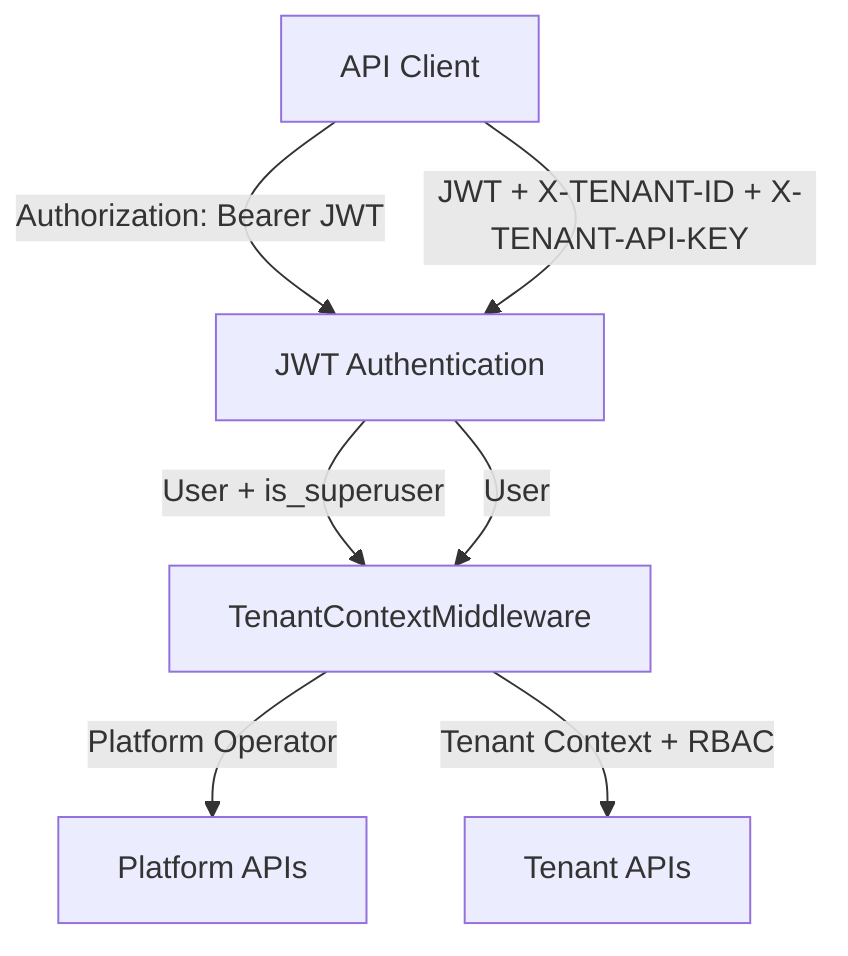
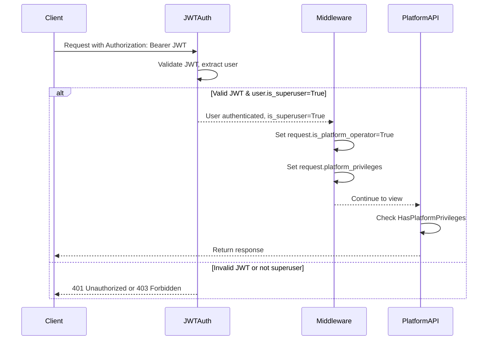
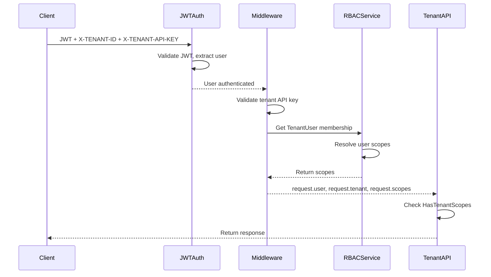

# Design Document

## Overview

This design implements a platform operator access system that allows super admins to manage the WabotIQ platform through APIs without being tied to specific tenants. The system uses JWT-based authentication with platform-level privileges, separate from the existing tenant-based authentication system.

The design maintains full backward compatibility with existing tenant APIs while adding a parallel authentication path for platform-level operations. Platform operators can perform cross-tenant operations like viewing all tenants, aggregating analytics, and managing system configuration.

**Authentication Model**:
- **Platform APIs**: JWT token only (in Authorization header) - no tenant context required
- **Tenant APIs**: JWT token + X-TENANT-ID + X-TENANT-API-KEY headers - requires both user auth and tenant context
- **Tenant Self-Service**: JWT token only - for users managing their own tenant during onboarding

## Architecture

### High-Level Architecture



### Authentication Flows

#### Platform Operator Authentication



#### Tenant API Authentication



### Authentication System

The system supports three authentication patterns:

1. **Platform Operator** (new): JWT token only - for superusers accessing platform-level APIs
2. **Tenant User** (existing): JWT + X-TENANT-ID + X-TENANT-API-KEY - for users accessing tenant-scoped APIs
3. **Tenant Self-Service** (new): JWT token only - for users managing their own tenant during onboarding


## Components and Interfaces

### 1. JWT Authentication

**Location**: `apps/core/authentication.py`

**JWT Token Structure**:
```json
{
  "user_id": "uuid",
  "email": "user@example.com",
  "is_superuser": false,
  "exp": 1234567890,
  "iat": 1234567890
}
```

**Authentication Class**: `JWTAuthentication`
- Extracts JWT from `Authorization: Bearer <token>` header
- Validates token signature and expiration
- Returns User instance
- Sets `request.user` for downstream middleware

**Token Generation**:
- Login endpoint generates JWT with user claims
- Access token expires in 1 hour
- Refresh token expires in 7 days
- Tokens signed with SECRET_KEY

**Dependencies**:
- `PyJWT` library for token encoding/decoding
- `djangorestframework-simplejwt` for token management


### 2. Platform Privilege System

**Canonical Platform Privileges**:

```python
PLATFORM_PRIVILEGES = {
    # Tenant Management
    'platform:tenants:view': 'View all tenants and their details',
    'platform:tenants:manage': 'Create, update, suspend tenants',
    
    # Analytics
    'platform:analytics:view': 'View system-wide analytics and metrics',
    
    # User Management
    'platform:users:view': 'View all users across tenants',
    
    # System Configuration
    'platform:system:configure': 'Modify system-wide settings',
    
    # Integrations
    'platform:integrations:view': 'View integration configurations',
    
    # Finance
    'platform:finance:view': 'View financial data across tenants',
    
    # Audit
    'platform:audit:view': 'View platform audit logs',
}
```

**Validation Service**:

**Location**: `apps/rbac/services.py` - Add `PlatformPrivilegeService` class

**Methods**:
- `validate_privileges(privileges)`: Ensure all privileges are recognized
- `has_privilege(api_key, privilege)`: Check if key has privilege
- `get_all_privileges()`: Return dict of all platform privileges


### 3. Middleware Enhancement

**Location**: `apps/tenants/middleware.py` - Modify `TenantContextMiddleware`

**New Logic Flow**:

```python
def process_request(self, request):
    # 1. Check for public paths (unchanged)
    if self._is_public_path(request.path):
        return None
    
    # 2. Check for platform API key (NEW)
    platform_api_key = request.headers.get('X-PLATFORM-API-KEY')
    if platform_api_key:
        return self._authenticate_platform(request, platform_api_key)
    
    # 3. Fall back to tenant authentication (existing)
    return self._authenticate_tenant(request)
```

**New Methods**:
- `_authenticate_platform(request, api_key)`: Validate platform key, set request attributes
- `_validate_platform_key(api_key)`: Check key validity and expiration

**Request Attributes Set for Platform Auth**:
- `request.is_platform_operator = True`
- `request.platform_privileges = set(['privilege1', 'privilege2'])`
- `request.platform_api_key = PlatformAPIKey instance`
- `request.tenant = None`
- `request.membership = None`
- `request.scopes = set()` (empty, not used for platform)


### 4. Platform Permission Class

**Location**: `apps/core/permissions.py`

**New Class**: `HasPlatformPrivileges`

```python
class HasPlatformPrivileges(BasePermission):
    """
    DRF permission class for platform-level endpoints.
    
    Checks:
    1. request.is_platform_operator is True
    2. request.platform_privileges contains all required_platform_privileges
    """
    
    def has_permission(self, request, view):
        # Check if platform operator
        if not getattr(request, 'is_platform_operator', False):
            return False
        
        # Get required privileges from view
        required_privileges = getattr(view, 'required_platform_privileges', None)
        if not required_privileges:
            return True
        
        # Check if all required privileges present
        user_privileges = getattr(request, 'platform_privileges', set())
        missing = set(required_privileges) - user_privileges
        
        if missing:
            # Log denial
            return False
        
        return True
```

**New Decorator**: `@requires_platform_privileges(*privileges)`

Similar to `@requires_scopes` but for platform privileges.


### 5. Platform API Endpoints

**Location**: New app `apps/platform/` or add to `apps/rbac/`

**URL Structure**: `/v1/platform/*`

#### Tenant Management Endpoints

**GET /v1/platform/tenants**
- Required privilege: `platform:tenants:view`
- Query params: `page`, `page_size`, `status`, `search`
- Returns: Paginated list of tenants with summary data

**GET /v1/platform/tenants/{id}**
- Required privilege: `platform:tenants:view`
- Returns: Detailed tenant information including settings, subscription, usage

**POST /v1/platform/tenants**
- Required privilege: `platform:tenants:manage`
- Body: Tenant creation data
- Returns: Created tenant object

**PATCH /v1/platform/tenants/{id}**
- Required privilege: `platform:tenants:manage`
- Body: Partial tenant update
- Returns: Updated tenant object

**POST /v1/platform/tenants/{id}/suspend**
- Required privilege: `platform:tenants:manage`
- Body: `{reason, suspend_until}`
- Returns: Updated tenant with suspended status

**POST /v1/platform/tenants/{id}/activate**
- Required privilege: `platform:tenants:manage`
- Returns: Updated tenant with active status


#### Analytics Endpoints

**GET /v1/platform/analytics/overview**
- Required privilege: `platform:analytics:view`
- Query params: `start_date`, `end_date`
- Returns: Aggregated metrics across all tenants
  ```json
  {
    "total_tenants": 150,
    "active_tenants": 142,
    "trial_tenants": 25,
    "total_customers": 45000,
    "total_orders": 12500,
    "total_messages": 250000,
    "total_revenue": 125000.00,
    "period": {"start": "2025-10-01", "end": "2025-11-01"}
  }
  ```

**GET /v1/platform/analytics/tenants**
- Required privilege: `platform:analytics:view`
- Query params: `start_date`, `end_date`, `page`, `page_size`, `sort_by`
- Returns: Per-tenant metrics with pagination
  ```json
  {
    "results": [
      {
        "tenant_id": "uuid",
        "tenant_name": "Acme Corp",
        "customers": 500,
        "orders": 150,
        "messages": 3000,
        "revenue": 1500.00,
        "subscription_status": "active"
      }
    ]
  }
  ```

**GET /v1/platform/analytics/growth**
- Required privilege: `platform:analytics:view`
- Query params: `metric` (tenants|customers|revenue), `period` (daily|weekly|monthly)
- Returns: Time-series growth data


#### Audit Log Endpoints

**GET /v1/platform/audit-logs**
- Required privilege: `platform:audit:view`
- Query params: `start_date`, `end_date`, `action`, `tenant_id`, `user_email`, `page`, `page_size`
- Returns: Paginated platform audit logs

**GET /v1/platform/audit-logs/{id}**
- Required privilege: `platform:audit:view`
- Returns: Detailed audit log entry

#### API Key Management Endpoints

**GET /v1/platform/api-keys**
- Required privilege: `platform:system:configure`
- Returns: List of platform API keys (without key values)

**POST /v1/platform/api-keys**
- Required privilege: `platform:system:configure`
- Body: `{name, description, privileges, expires_at}`
- Returns: Created key with plaintext key value (only shown once)

**POST /v1/platform/api-keys/{id}/rotate**
- Required privilege: `platform:system:configure`
- Returns: New plaintext key value (only shown once)

**DELETE /v1/platform/api-keys/{id}**
- Required privilege: `platform:system:configure`
- Returns: 204 No Content


### 6. Audit Logging

**Location**: Extend `apps/rbac/models.py` - `AuditLog` model

**New Action Types**:
- `platform_api_key_created`
- `platform_api_key_rotated`
- `platform_api_key_deleted`
- `platform_tenant_created`
- `platform_tenant_updated`
- `platform_tenant_suspended`
- `platform_tenant_activated`
- `platform_analytics_accessed`

**Audit Log Fields** (existing model, no changes needed):
- `tenant`: NULL for platform operations
- `user`: NULL (platform operations use API key, not user)
- `action`: Action type
- `target_type`: e.g., 'Tenant', 'PlatformAPIKey'
- `target_id`: ID of affected resource
- `diff`: Before/after changes
- `ip_address`: Request IP
- `request_id`: Request tracing ID
- `metadata`: Additional context including `platform_api_key_id`

**Service Method**:

```python
@classmethod
def log_platform_action(cls, action, api_key, target_type=None, 
                       target_id=None, diff=None, metadata=None, request=None):
    """Log platform operator action."""
    metadata = metadata or {}
    metadata['platform_api_key_id'] = str(api_key.id)
    metadata['platform_api_key_name'] = api_key.name
    
    return cls.log_action(
        action=action,
        user=None,  # Platform operations don't have user
        tenant=None,  # Platform operations are cross-tenant
        target_type=target_type,
        target_id=target_id,
        diff=diff,
        metadata=metadata,
        request=request
    )
```


## Data Models

### PlatformAPIKey Model Schema

```python
class PlatformAPIKey(BaseModel):
    """Platform API key for super admin access."""
    
    # Key identification
    key_hash = models.CharField(max_length=64, unique=True, db_index=True)
    name = models.CharField(max_length=255)
    description = models.TextField(blank=True)
    
    # Privileges
    privileges = models.JSONField(
        default=list,
        help_text="Array of platform privilege codes"
    )
    
    # Status
    is_active = models.BooleanField(default=True, db_index=True)
    expires_at = models.DateTimeField(null=True, blank=True, db_index=True)
    
    # Usage tracking
    last_used_at = models.DateTimeField(null=True, blank=True)
    last_used_ip = models.GenericIPAddressField(null=True, blank=True)
    
    # Audit
    created_by = models.ForeignKey(
        'rbac.User',
        on_delete=models.SET_NULL,
        null=True,
        related_name='platform_keys_created'
    )
    
    class Meta:
        db_table = 'platform_api_keys'
        ordering = ['-created_at']
        indexes = [
            models.Index(fields=['is_active', 'expires_at']),
            models.Index(fields=['last_used_at']),
        ]
```

### Database Migration

**Migration file**: `apps/rbac/migrations/000X_add_platform_api_keys.py`

Creates `platform_api_keys` table with all fields and indexes.


## Error Handling

### Authentication Errors

**401 Unauthorized**:
```json
{
  "error": {
    "code": "INVALID_PLATFORM_KEY",
    "message": "Invalid or expired platform API key"
  }
}
```

**401 Unauthorized** (expired):
```json
{
  "error": {
    "code": "PLATFORM_KEY_EXPIRED",
    "message": "Platform API key expired on 2025-11-01",
    "details": {
      "expired_at": "2025-11-01T00:00:00Z"
    }
  }
}
```

### Authorization Errors

**403 Forbidden** (missing privilege):
```json
{
  "error": {
    "code": "INSUFFICIENT_PRIVILEGES",
    "message": "Missing required platform privileges",
    "details": {
      "required": ["platform:tenants:manage"],
      "missing": ["platform:tenants:manage"]
    }
  }
}
```

**403 Forbidden** (tenant key on platform endpoint):
```json
{
  "error": {
    "code": "PLATFORM_ACCESS_REQUIRED",
    "message": "This endpoint requires platform API key authentication"
  }
}
```

### Rate Limiting

**429 Too Many Requests**:
```json
{
  "error": {
    "code": "RATE_LIMIT_EXCEEDED",
    "message": "Rate limit exceeded for platform API key",
    "details": {
      "limit": 100,
      "window": "1 minute",
      "retry_after": 45
    }
  }
}
```


## Testing Strategy

### Unit Tests

**Test File**: `apps/rbac/tests/test_platform_api_keys.py`

Test cases:
- `test_create_platform_api_key`: Key generation and hashing
- `test_validate_platform_api_key`: Key validation logic
- `test_platform_key_expiration`: Expired keys rejected
- `test_platform_key_privileges`: Privilege checking
- `test_rotate_platform_key`: Key rotation maintains privileges
- `test_deactivate_platform_key`: Deactivated keys rejected

**Test File**: `apps/rbac/tests/test_platform_privilege_service.py`

Test cases:
- `test_validate_privileges`: Valid/invalid privilege codes
- `test_has_privilege`: Privilege checking logic
- `test_get_all_privileges`: Returns complete privilege list

### Middleware Tests

**Test File**: `apps/tenants/tests/test_platform_middleware.py`

Test cases:
- `test_platform_key_authentication`: Valid key sets request attributes
- `test_platform_key_invalid`: Invalid key returns 401
- `test_platform_key_expired`: Expired key returns 401
- `test_platform_key_precedence`: Platform key takes precedence over tenant key
- `test_tenant_key_still_works`: Tenant auth unchanged
- `test_public_paths_bypass`: Public paths skip all auth

### Permission Class Tests

**Test File**: `apps/core/tests/test_platform_permissions.py`

Test cases:
- `test_has_platform_privileges_success`: User with privilege can access
- `test_has_platform_privileges_missing`: User without privilege gets 403
- `test_requires_platform_privileges_decorator`: Decorator works correctly
- `test_tenant_user_cannot_access_platform`: Tenant auth rejected on platform endpoints


### API Integration Tests

**Test File**: `apps/platform/tests/test_platform_tenant_api.py`

Test cases:
- `test_list_tenants_with_privilege`: Can list tenants with correct privilege
- `test_list_tenants_without_privilege`: 403 without privilege
- `test_create_tenant_with_privilege`: Can create tenant
- `test_suspend_tenant`: Can suspend tenant
- `test_tenant_isolation_maintained`: Platform ops don't break tenant isolation

**Test File**: `apps/platform/tests/test_platform_analytics_api.py`

Test cases:
- `test_analytics_overview`: Returns correct aggregated metrics
- `test_analytics_per_tenant`: Returns per-tenant breakdown
- `test_analytics_date_filtering`: Date range filtering works
- `test_analytics_without_privilege`: 403 without privilege

**Test File**: `apps/platform/tests/test_platform_audit_api.py`

Test cases:
- `test_list_audit_logs`: Can retrieve audit logs
- `test_audit_log_filtering`: Filtering by action, tenant, date works
- `test_platform_actions_logged`: Platform operations create audit entries

### Security Tests

**Test File**: `apps/platform/tests/test_platform_security.py`

Test cases:
- `test_rate_limiting`: Rate limits enforced
- `test_key_rotation_invalidates_old`: Old key stops working after rotation
- `test_ip_tracking`: IP address changes logged
- `test_expired_key_rejected`: Expired keys cannot authenticate
- `test_cross_tenant_data_access`: Platform can access all tenant data
- `test_tenant_key_on_platform_endpoint`: Tenant keys rejected on platform endpoints
- `test_platform_key_on_tenant_endpoint`: Platform keys rejected on tenant endpoints


## Security Considerations

### Key Generation and Storage

- **Key Generation**: Use `secrets.token_urlsafe(32)` for 256-bit entropy
- **Key Hashing**: SHA-256 hash stored in database, plaintext never stored
- **Key Display**: Plaintext key shown only once at creation/rotation
- **Key Format**: `plat_` prefix for easy identification (e.g., `plat_abc123...`)

### Rate Limiting

**Implementation**: Use `django-ratelimit` decorator

```python
@ratelimit(key='header:X-PLATFORM-API-KEY', rate='100/m', method='ALL')
def platform_view(request):
    pass
```

**Limits**:
- 100 requests per minute per API key for read operations
- 20 requests per minute per API key for write operations
- 10 requests per minute per API key for sensitive operations (suspend, delete)

### IP Tracking and Alerting

- Track IP address on every request
- Log new IP addresses to audit trail
- Optional: Send alert when key used from new IP (future enhancement)
- Store last 10 IP addresses used per key in metadata

### Expiration and Rotation

- Support optional expiration dates
- Automatic deactivation on expiration
- Key rotation generates new key, maintains privileges
- Old key immediately invalidated on rotation
- Recommend 90-day rotation policy

### Privilege Validation

- Validate privileges on key creation against canonical list
- Reject unknown privilege codes
- Log privilege checks for audit
- Principle of least privilege: grant minimum necessary privileges


## Performance Optimization

### Caching Strategy

**Platform API Key Validation**:
- Cache validated keys for 5 minutes
- Cache key: `platform_key:{key_hash}`
- Invalidate on key rotation, deactivation, or expiration

```python
def validate_platform_key(raw_key):
    key_hash = hashlib.sha256(raw_key.encode()).hexdigest()
    cache_key = f'platform_key:{key_hash}'
    
    # Check cache
    cached = cache.get(cache_key)
    if cached:
        return cached
    
    # Validate from database
    api_key = PlatformAPIKey.objects.validate_and_get(raw_key)
    
    # Cache result
    if api_key:
        cache.set(cache_key, api_key, 300)  # 5 minutes
    
    return api_key
```

### Database Query Optimization

**Analytics Queries**:
- Use database aggregation (COUNT, SUM) instead of Python loops
- Add indexes on frequently queried fields (status, created_at)
- Use `select_related` and `prefetch_related` for related data
- Consider materialized views for complex analytics (future enhancement)

**Tenant Listing**:
- Paginate results (default 50 per page)
- Use `only()` to fetch required fields only
- Add search indexes for name/slug fields

### Request Optimization

- Compress responses with gzip
- Use ETags for caching
- Support conditional requests (If-None-Match)
- Return minimal data by default, support `?expand=` for details


## Backward Compatibility

### Existing Tenant APIs

**No Changes Required**:
- All existing tenant-scoped endpoints continue to work unchanged
- Tenant authentication flow remains identical
- RBAC scope checking unchanged
- No migration needed for existing API clients

### Middleware Compatibility

**Request Attribute Guarantees**:
- Tenant-authenticated requests: `request.tenant`, `request.membership`, `request.scopes` set as before
- Platform-authenticated requests: `request.is_platform_operator`, `request.platform_privileges` set
- Public paths: All attributes set to None/empty as before

### Permission Class Compatibility

**Existing Permission Classes**:
- `HasTenantScopes`: Works unchanged, checks `request.scopes`
- Platform endpoints use new `HasPlatformPrivileges` class
- No conflicts between the two systems

### Migration Path

**Phase 1**: Deploy platform API key system (no breaking changes)
**Phase 2**: Create initial platform API keys via Django admin
**Phase 3**: Platform operators start using new endpoints
**Phase 4**: Monitor and optimize based on usage

**Rollback Plan**:
- Platform API key system can be disabled via feature flag
- Middleware falls back to tenant-only authentication
- No data loss or corruption risk


## OpenAPI Documentation

### Security Scheme

```yaml
components:
  securitySchemes:
    PlatformAPIKey:
      type: apiKey
      in: header
      name: X-PLATFORM-API-KEY
      description: Platform operator API key for super admin access
    
    TenantAPIKey:
      type: apiKey
      in: header
      name: X-TENANT-API-KEY
      description: Tenant-scoped API key (existing)
```

### Platform Endpoint Documentation

```yaml
paths:
  /v1/platform/tenants:
    get:
      summary: List all tenants
      security:
        - PlatformAPIKey: []
      parameters:
        - name: page
          in: query
          schema:
            type: integer
        - name: status
          in: query
          schema:
            type: string
            enum: [active, trial, suspended, cancelled]
      responses:
        '200':
          description: Paginated list of tenants
        '401':
          description: Invalid or expired platform API key
        '403':
          description: Missing required privilege (platform:tenants:view)
        '429':
          description: Rate limit exceeded
      x-required-privileges:
        - platform:tenants:view
```

### Response Schemas

Include detailed schemas for all platform endpoints in OpenAPI spec.


## Deployment Considerations

### Environment Variables

```bash
# Platform API Key Settings
PLATFORM_API_KEY_RATE_LIMIT=100  # Requests per minute
PLATFORM_API_KEY_CACHE_TTL=300   # Cache TTL in seconds
PLATFORM_API_KEY_ROTATION_DAYS=90  # Recommended rotation period
PLATFORM_ANALYTICS_CACHE_TTL=600  # Analytics cache TTL
```

### Initial Setup

**Step 1**: Run migrations
```bash
python manage.py migrate rbac
```

**Step 2**: Create initial platform API key via Django admin or management command
```bash
python manage.py create_platform_key \
  --name "Primary Platform Admin" \
  --privileges platform:tenants:view,platform:tenants:manage,platform:analytics:view \
  --created-by admin@example.com
```

**Step 3**: Store key securely (1Password, AWS Secrets Manager, etc.)

**Step 4**: Test authentication
```bash
curl -H "X-PLATFORM-API-KEY: plat_abc123..." \
  https://api.example.com/v1/platform/tenants
```

### Monitoring

**Metrics to Track**:
- Platform API key usage by key name
- Failed authentication attempts
- Rate limit hits
- Response times for platform endpoints
- Audit log volume

**Alerts**:
- Failed authentication spike (potential attack)
- Rate limit exceeded frequently (need to increase limits)
- Platform key used from new IP
- Platform key approaching expiration


## Example Usage

### Creating a Platform API Key

**Django Admin**:
1. Navigate to RBAC > Platform API Keys
2. Click "Add Platform API Key"
3. Fill in name, description, select privileges
4. Save - plaintext key displayed once
5. Copy and store securely

**Management Command**:
```bash
python manage.py create_platform_key \
  --name "Analytics Dashboard" \
  --description "Read-only key for analytics dashboard" \
  --privileges platform:analytics:view,platform:tenants:view \
  --expires-in-days 90
```

### Using Platform API Key

**List All Tenants**:
```bash
curl -X GET \
  -H "X-PLATFORM-API-KEY: plat_abc123..." \
  https://api.example.com/v1/platform/tenants?page=1&page_size=50
```

**Get System Analytics**:
```bash
curl -X GET \
  -H "X-PLATFORM-API-KEY: plat_abc123..." \
  https://api.example.com/v1/platform/analytics/overview?start_date=2025-10-01&end_date=2025-11-01
```

**Create New Tenant**:
```bash
curl -X POST \
  -H "X-PLATFORM-API-KEY: plat_abc123..." \
  -H "Content-Type: application/json" \
  -d '{
    "name": "New Customer Corp",
    "slug": "new-customer",
    "email": "admin@newcustomer.com",
    "subscription_tier": "professional"
  }' \
  https://api.example.com/v1/platform/tenants
```

**Rotate API Key**:
```bash
curl -X POST \
  -H "X-PLATFORM-API-KEY: plat_abc123..." \
  https://api.example.com/v1/platform/api-keys/{key_id}/rotate
```

Response:
```json
{
  "id": "uuid",
  "name": "Analytics Dashboard",
  "new_key": "plat_xyz789...",
  "message": "Key rotated successfully. Store the new key securely - it will not be shown again."
}
```


## Future Enhancements

### Phase 2 Features (Not in Initial Implementation)

1. **IP Whitelisting**: Restrict platform keys to specific IP ranges
2. **Webhook Notifications**: Alert on suspicious activity
3. **Multi-Factor Authentication**: Require MFA for sensitive platform operations
4. **Granular Tenant Permissions**: Platform keys scoped to specific tenants
5. **API Key Scopes**: More granular privileges (e.g., `platform:tenants:view:active`)
6. **Usage Analytics**: Dashboard showing platform API key usage patterns
7. **Automatic Key Rotation**: Scheduled rotation with notification
8. **Emergency Revocation**: Instant revocation across all servers
9. **Audit Log Export**: Export audit logs to external systems
10. **Platform User Accounts**: Dedicated platform user accounts instead of just API keys

### Scalability Considerations

- **Redis Caching**: Move from Django cache to Redis for distributed caching
- **Read Replicas**: Use read replicas for analytics queries
- **Materialized Views**: Pre-compute complex analytics
- **GraphQL API**: Alternative to REST for flexible data fetching
- **Streaming Analytics**: Real-time analytics using Kafka/streaming

## Design Decisions and Rationale

### Why Separate from Tenant RBAC?

Platform operations are fundamentally different from tenant operations:
- Cross-tenant scope vs single-tenant scope
- Different privilege model (platform vs tenant scopes)
- Different authentication mechanism (API key only vs API key + user)
- Simpler model for platform operators (no roles, just privileges)

### Why API Keys Instead of User Accounts?

- Simpler for automation and scripts
- No password management complexity
- Easier to rotate and revoke
- Better for service-to-service communication
- Can add user accounts in Phase 2 if needed

### Why Middleware Instead of Decorator?

- Centralized authentication logic
- Consistent with existing tenant authentication
- Request attributes available to all views
- Easier to test and maintain
- Better performance (single check per request)

