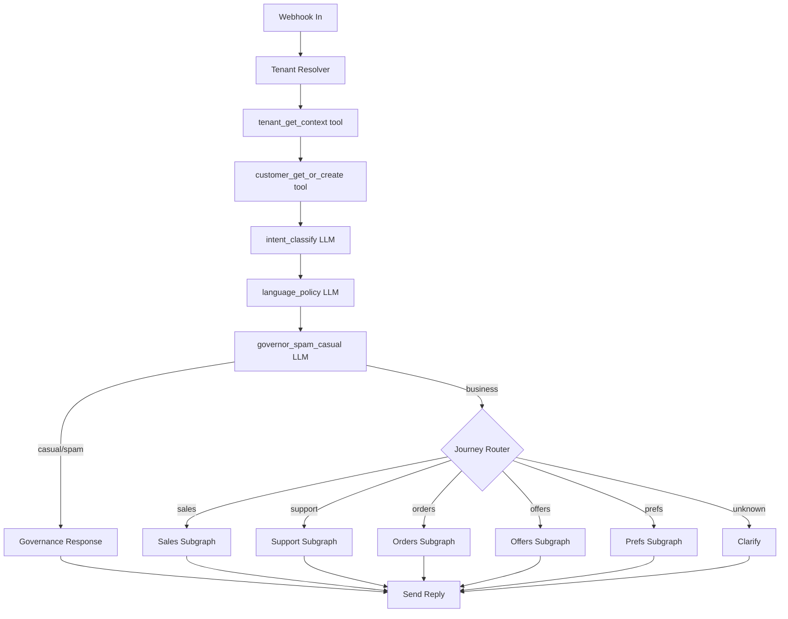
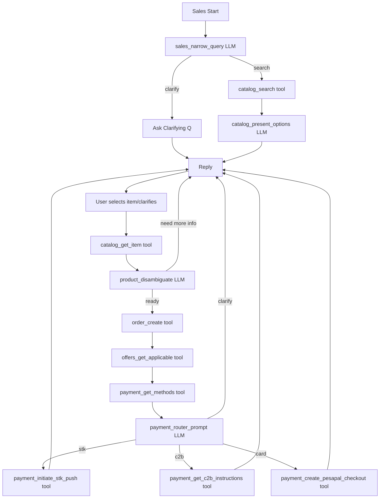
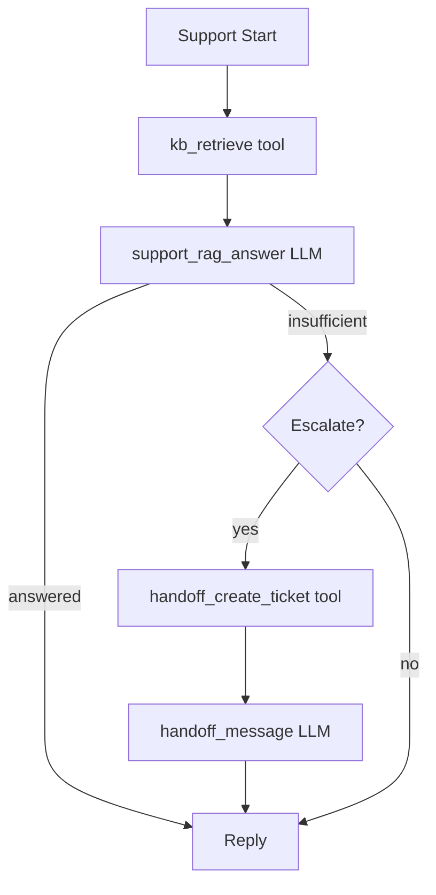
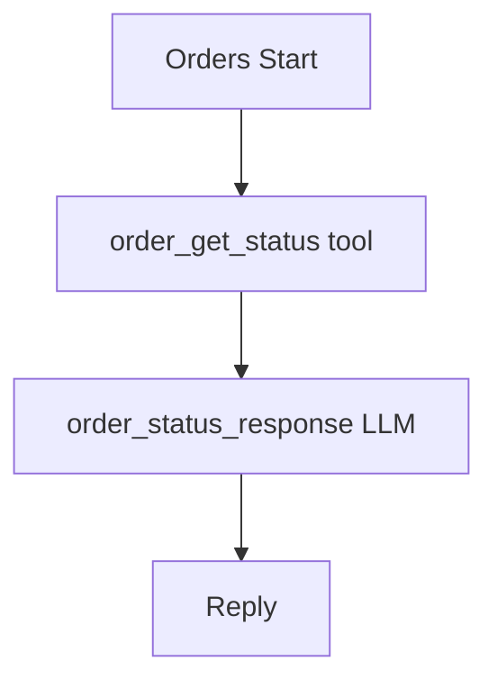
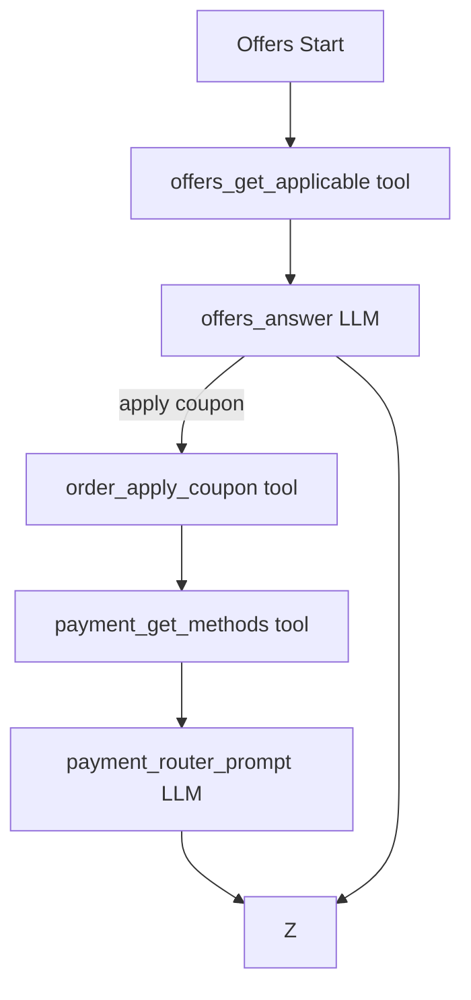
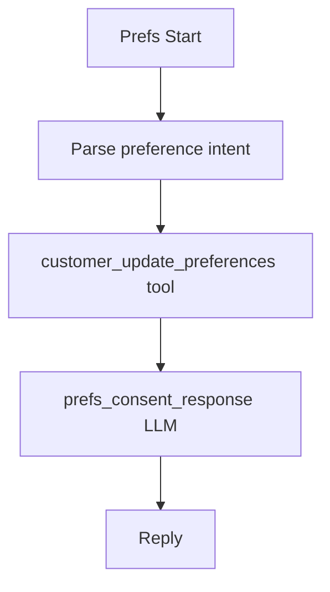

# Design Document

## Overview

Tulia AI V2 represents a complete architectural transformation from a traditional chatbot to a LangGraph-orchestrated commerce agent. The system is designed as a stateful, tool-driven agent that converts WhatsApp conversations into revenue while maintaining strict tenant isolation and predictable behavior.

The core architecture follows a state machine pattern where every conversation flows through LangGraph nodes that manage business logic, data retrieval, and response generation. The system explicitly avoids prompt engineering in favor of structured workflows and backend tool integration.

## Architecture

### High-Level Architecture

```
WhatsApp (Twilio per tenant)
         ↓
Webhook Gateway
         ↓
Tenant Resolver
         ↓
Conversation Orchestrator (LangGraph)
         ↓
┌───────────────────────────────────────────┐
│ Shared Governance Layer                    │
│ - Intent classification                   │
│ - Language policy                          │
│ - Spam / casual detection                 │
│ - Consent enforcement                     │
└───────────────────────────────────────────┘
         ↓
Journey Router
         ↓
┌────────────┬────────────┬────────────┬────────────┐
│ Sales      │ Support    │ Orders     │ Preferences│
│ Journey    │ Journey    │ Journey    │ Journey    │
└────────────┴────────────┴────────────┴────────────┘
         ↓
Response Generator (grounded)
```

### LangGraph State Machine Design

The system uses LangGraph as the core orchestrator with specific routing thresholds and node types:

#### Routing Thresholds (Zero Ambiguity)
- **Intent routing**: confidence >= 0.70 routes to journey; 0.50-0.70 asks clarifying question; < 0.50 routes to unknown handler
- **Language policy**: confidence >= 0.75 switches language (if allowed); < 0.75 uses tenant default
- **Conversation governor**: business proceeds; casual allows max 2 turns before redirect; spam allows 2 turns then disengages; abuse stops immediately
- **Catalog link fallback**: shown when matches >= 50 and vague, or user requests "see all", or low confidence results, or 2 consecutive rejections

#### Node Architecture
1. **Entry Nodes**: Webhook receiver, tenant resolver, customer resolver
2. **Classification Nodes**: intent_classify, language_policy, governor_spam_casual (all JSON output)
3. **Journey Router**: Routes based on intent confidence and classification
4. **Journey Subgraphs**: Sales, Support, Orders, Offers, Preferences (each with specific LLM + tool nodes)
5. **Tool Nodes**: 15 exact tools with strict JSON schemas
6. **Response Nodes**: Natural language generation with WhatsApp formatting
7. **Exit Node**: Response delivery and state persistence

#### LangGraph Flow Diagram


### Tenant Isolation Architecture

Tenant isolation is enforced at multiple architectural layers:

- **Data Layer**: All database queries include tenant_id filtering
- **Vector DB Layer**: Separate namespaces per tenant for RAG operations
- **Memory Layer**: Conversation state is tenant-scoped
- **Tool Layer**: All tool calls require explicit tenant_id parameters
- **Cache Layer**: Redis keys include tenant_id prefixes

## Components and Interfaces

### Core Components

#### ConversationState Schema (Canonical)
```python
from dataclasses import dataclass, field
from typing import Any, Dict, List, Optional, Literal

Intent = Literal[
  "sales_discovery", "product_question", "support_question", "order_status",
  "discounts_offers", "preferences_consent", "payment_help",
  "human_request", "spam_casual", "unknown"
]

Journey = Literal["sales", "support", "orders", "offers", "prefs", "governance", "unknown"]
Lang = Literal["en", "sw", "sheng", "mixed"]
GovernorClass = Literal["business", "casual", "spam", "abuse"]

@dataclass
class ConversationState:
    # Identity & scoping
    tenant_id: str
    conversation_id: str
    request_id: str
    customer_id: Optional[str] = None
    phone_e164: Optional[str] = None  # only when needed for STK

    # Tenant context
    tenant_name: Optional[str] = None
    bot_name: Optional[str] = None
    bot_intro: Optional[str] = None
    tone_style: str = "friendly_concise"
    default_language: Lang = "en"
    allowed_languages: List[str] = field(default_factory=lambda: ["en", "sw", "sheng"])
    max_chattiness_level: int = 2  # 0..3 recommended
    catalog_link_base: Optional[str] = None
    payments_enabled: Dict[str, bool] = field(default_factory=dict)
    compliance: Dict[str, Any] = field(default_factory=dict)
    handoff: Dict[str, Any] = field(default_factory=dict)

    # Customer preferences / consent
    customer_language_pref: Optional[Lang] = None
    marketing_opt_in: Optional[bool] = None
    notification_prefs: Dict[str, bool] = field(default_factory=dict)

    # Classifiers
    intent: Intent = "unknown"
    intent_confidence: float = 0.0
    journey: Journey = "unknown"

    response_language: Lang = "en"
    language_confidence: float = 0.0

    governor_classification: GovernorClass = "business"
    governor_confidence: float = 0.0

    # Catalog selection & ordering
    last_catalog_query: Optional[str] = None
    last_catalog_filters: Dict[str, Any] = field(default_factory=dict)
    last_catalog_results: List[Dict[str, Any]] = field(default_factory=list)
    catalog_total_matches_estimate: Optional[int] = None
    selected_item_ids: List[str] = field(default_factory=list)

    cart: List[Dict[str, Any]] = field(default_factory=list)  # [{item_id, qty, variant_selection}]
    order_id: Optional[str] = None
    order_totals: Dict[str, Any] = field(default_factory=dict)
    payment_request_id: Optional[str] = None
    payment_status: Optional[str] = None  # pending/paid/failed/unknown

    # Retrieval context (RAG)
    kb_snippets: List[Dict[str, Any]] = field(default_factory=list)

    # Safety / escalation
    escalation_required: bool = False
    escalation_reason: Optional[str] = None
    handoff_ticket_id: Optional[str] = None

    # Conversation controls
    turn_count: int = 0
    casual_turns: int = 0
    spam_turns: int = 0

    # Output
    response_text: Optional[str] = None
```

#### LangGraph Orchestrator
- **Purpose**: Central state machine managing all conversation flows
- **Responsibilities**: Route messages, execute journeys, maintain state consistency
- **Interface**: Processes ConversationState through defined node graph

#### Conversation Governor
- **Purpose**: Cost control, spam detection, and conversation boundaries
- **Responsibilities**: Intent classification, chattiness limits, rate limiting
- **Interface**: Filters and validates conversations before journey routing

#### Journey Managers
- **Sales Journey Manager**: Handles product discovery, selection, ordering, and payment
- **Support Journey Manager**: Provides RAG-based answers from tenant documents
- **Orders Journey Manager**: Manages order lookups, status checks, and modifications
- **Preferences Journey Manager**: Handles consent, language, and notification preferences

#### Tool Contracts Interface

The system implements exactly 15 tools with strict JSON schemas:

1. **tenant_get_context** - Fetch tenant configuration and bot persona
2. **customer_get_or_create** - Get/create tenant-scoped customer profile
3. **customer_update_preferences** - Update customer preferences with audit trail
4. **catalog_search** - Search tenant catalog with semantic + structured filters
5. **catalog_get_item** - Fetch authoritative item details
6. **order_create** - Create order draft with totals calculation
7. **offers_get_applicable** - Fetch applicable offers/coupons
8. **order_apply_coupon** - Apply coupon and return updated totals
9. **payment_get_methods** - Get enabled payment methods for tenant
10. **payment_get_c2b_instructions** - Generate MPESA C2B instructions
11. **payment_initiate_stk_push** - Initiate MPESA STK push
12. **payment_create_pesapal_checkout** - Create PesaPal checkout URL
13. **order_get_status** - Fetch order and payment status
14. **kb_retrieve** - Tenant-scoped vector search for support
15. **handoff_create_ticket** - Create human handoff with context

All tools require: `tenant_id`, `request_id`, `conversation_id` for traceability and tenant isolation.

## Data Models

### Tenant Model Extensions
```python
class Tenant:
    id: UUID
    name: str
    bot_name: str
    tone_style: str
    default_language: str
    allowed_languages: List[str]
    max_chattiness: int
    payment_methods_enabled: List[str]
    escalation_rules: Dict[str, Any]
```

### Customer Model (Tenant-Scoped)
```python
class Customer:
    tenant_id: UUID
    phone_e164: str  # Composite key with tenant_id
    language_preference: str
    marketing_opt_in: bool
    tags: List[str]
    last_seen: datetime
    consent_flags: Dict[str, bool]
```

### Conversation Session Model
```python
class ConversationSession:
    id: UUID
    tenant_id: UUID
    customer_id: UUID
    state: ConversationState
    created_at: datetime
    updated_at: datetime
    is_active: bool
```

### Knowledge Sources Models
```python
class TenantDocument:
    id: UUID
    tenant_id: UUID
    title: str
    content: str
    document_type: str  # pdf, docx, faq, policy
    vector_embeddings: List[float]
    created_at: datetime

class ConversationSummary:
    id: UUID
    tenant_id: UUID
    summary: str
    approved: bool
    vector_embeddings: List[float]
    created_at: datetime
```

## Error Handling

### Error Categories and Responses

1. **Tool Failures**: Graceful degradation with fallback responses
2. **Payment Failures**: Clear error messages with retry options
3. **RAG Failures**: Escalation to human support with context
4. **State Corruption**: Session reset with conversation restart
5. **Tenant Resolution Failures**: Immediate conversation termination

### Error Recovery Patterns

- **Circuit Breaker**: Prevent cascading failures in tool calls
- **Retry with Backoff**: Handle transient failures in external services
- **Graceful Degradation**: Provide limited functionality when components fail
- **Context Preservation**: Maintain conversation state during error recovery

## Testing Strategy

### Unit Testing Approach

Unit tests will focus on individual components and their specific behaviors:

- **Journey Node Testing**: Verify each journey step processes state correctly
- **Tool Contract Testing**: Mock backend services and verify tool call patterns
- **Governance Logic Testing**: Test intent classification, spam detection, and rate limiting
- **State Management Testing**: Verify ConversationState updates and persistence

### Property-Based Testing Requirements

The system will use Hypothesis (Python) for property-based testing with minimum 100 iterations per test. Each property-based test will be tagged with comments referencing the specific correctness property from this design document using the format: **Feature: tulia-ai-v2-langgraph-refactor, Property {number}: {property_text}**

Property-based tests will verify universal behaviors that should hold across all valid inputs and tenant configurations.

## Correctness Properties

*A property is a characteristic or behavior that should hold true across all valid executions of a system-essentially, a formal statement about what the system should do. Properties serve as the bridge between human-readable specifications and machine-verifiable correctness guarantees.*

### Property Reflection

After analyzing all acceptance criteria, several properties can be consolidated to eliminate redundancy:

- Properties about tool-only data sourcing (1.5, 4.1, 4.4, 7.2, 7.5, 13.2) can be combined into a comprehensive "No Data Hallucination" property
- Properties about tenant isolation (3.1, 3.2, 3.3, 3.4, 3.5) can be combined into a comprehensive "Tenant Isolation" property  
- Properties about state management (2.2, 2.3, 2.5) can be combined into a comprehensive "Explicit State Management" property
- Properties about payment processing (7.2, 7.3, 7.4, 7.5) can be combined into a comprehensive "Secure Payment Processing" property

### Core Correctness Properties

**Property 1: LangGraph Orchestration Universality**
*For any* incoming WhatsApp message, the system should process it through the LangGraph orchestrator state machine, never bypassing the orchestration layer
**Validates: Requirements 1.1, 2.1**

**Property 2: No Data Hallucination**
*For any* business information request (prices, product details, order status, payment status), the system should retrieve data exclusively from backend tools and never generate or invent business facts
**Validates: Requirements 1.5, 4.1, 4.4, 7.2, 7.5, 13.2**

**Property 3: Tenant Isolation Enforcement**
*For any* data access operation, the system should enforce tenant scoping through composite keys, namespaced storage, and explicit tenant_id parameters, ensuring no cross-tenant data leakage
**Validates: Requirements 3.1, 3.2, 3.3, 3.4, 3.5**

**Property 4: Explicit State Management**
*For any* conversation transition, the system should maintain explicit ConversationState with all required fields and treat missing state information as unknown
**Validates: Requirements 2.2, 2.3, 2.5**

**Property 5: Complete Sales Journey Execution**
*For any* sales intent, the system should guide customers through the complete workflow from product discovery to payment confirmation without skipping steps
**Validates: Requirements 1.2, 13.1**

**Property 6: Product Discovery Constraints**
*For any* product search response, the system should return maximum 3-6 options and never dump complete catalogs into WhatsApp messages
**Validates: Requirements 5.1, 5.5**

**Property 7: Secure Payment Processing**
*For any* payment operation, the system should use backend tools exclusively, verify amounts with customers before initiation, and query authoritative sources for status
**Validates: Requirements 7.2, 7.3, 7.4, 7.5**

**Property 8: Language Policy Compliance**
*For any* language detection with low confidence, the system should maintain the tenant's default language rather than switching
**Validates: Requirements 6.2, 6.3**

**Property 9: Conversation Governance**
*For any* casual or spam intent detection, the system should redirect to business purposes and enforce rate limits per customer per tenant
**Validates: Requirements 8.1, 8.2, 8.3, 8.4**

**Property 10: Immediate Consent Processing**
*For any* STOP/UNSUBSCRIBE command or consent withdrawal, the system should process the request immediately and update tenant-scoped consent flags
**Validates: Requirements 9.1, 9.3**

**Property 11: Consent Enforcement Consistency**
*For any* future interaction after consent withdrawal, the system should respect consent flags and maintain auditable consent records
**Validates: Requirements 9.4, 9.5**

**Property 12: Escalation Context Preservation**
*For any* escalation event, the system should provide clear reasons and comprehensive conversation context including tenant_id, customer_id, journey, and step
**Validates: Requirements 4.5, 10.2**

**Property 13: Graceful Failure Handling**
*For any* system component failure, the system should gracefully degrade while maintaining conversation continuity and logging detailed error context
**Validates: Requirements 10.1, 10.3**

**Property 14: Behavioral Consistency**
*For any* similar conversation inputs within the same tenant context, the system should produce consistent and predictable responses
**Validates: Requirements 13.4**

**Property 15: Catalog Fallback Behavior**
*For any* failed catalog narrowing attempt, the system should provide tenant-hosted catalog links with deep-linking capability
**Validates: Requirements 5.2, 5.3**

#### Journey Subgraph Details

**Sales Journey Flow:**


**Support Journey Flow:**


**Orders Journey Flow:**


**Offers Journey Flow:**


**Preferences Journey Flow:**


### LLM Node Specifications

The system includes 12 LLM nodes with exact prompt templates:

#### JSON Output Nodes (Structured)
1. **intent_classify** - Classifies user intent with confidence scores
2. **language_policy** - Determines response language based on detection confidence
3. **governor_spam_casual** - Classifies conversation as business/casual/spam/abuse
4. **sales_narrow_query** - Builds catalog search or asks clarifying questions
5. **payment_router_prompt** - Routes payment flow based on methods and preferences

#### Text Output Nodes (Natural Language)
6. **catalog_present_options** - Creates WhatsApp-friendly product shortlists (max 6 items)
7. **product_disambiguate** - Confirms item selection and gathers missing details
8. **support_rag_answer** - Answers using only retrieved knowledge base snippets
9. **offers_answer** - Explains applicable offers without invention
10. **order_status_response** - Summarizes order status from authoritative data
11. **prefs_consent_response** - Confirms preference updates with clear messaging
12. **handoff_message** - Informs customer of human escalation with expected timeline

### Conversation Governance Rules

#### Chattiness Control (Cost Management)
- **Level 0**: Strictly business only (no small talk)
- **Level 1**: Minimal friendliness (1 short greeting)
- **Level 2**: Friendly but bounded (default) - max 2 casual turns per conversation
- **Level 3**: More friendly - max 4 casual turns, but still enforce redirect

#### Escalation Triggers (Immediate)
- User explicitly requests human ("agent", "human", "call me")
- Payment disputes, chargebacks, refunds, delivery complaints beyond policy
- Missing authoritative info after RAG/tool attempts
- 2 consecutive tool errors or 3 clarification loops
- Sensitive/legal/medical content (tenant policy)
- User frustration detected + failure to resolve in 2 turns

#### WhatsApp UX Constraints
- Never show more than 6 catalog items in single reply
- Provide catalog link when: matches >= 50 and vague, user asks "see all", low confidence results, or 2 consecutive rejections
- Keep responses concise and actionable
- Use numbered lists for selections
- Always confirm amounts before payment initiation

### Payment Processing Specifications

#### Supported Methods (Kenya-focused)
1. **MPESA STK Push**: Direct phone prompt with amount confirmation
2. **MPESA C2B Instructions**: Paybill/Till number with unique reference
3. **PesaPal Checkout**: Hosted card payment with redirect handling

#### Payment Flow Requirements
- Always confirm amount and order details before initiation
- Provide clear status updates (pending/success/failed/timeout)
- Handle STK timeouts gracefully with alternative options
- Generate unique references for C2B tracking
- Support payment status queries ("did it go through?")

### Knowledge Base (RAG) Architecture

#### Tenant-Scoped Vector Storage
- Separate namespaces per tenant in vector database
- Support for PDF, DOCX, text document ingestion
- Document types: policy, faq, doc, sop
- Structured metadata storage (not raw user messages)

#### RAG Retrieval Strategy
- Semantic search with top-k results (max 8)
- Source type filtering (policy/faq/doc/sop)
- Confidence-based answer generation
- Escalation when insufficient context
- Never mix tenant knowledge bases

### Tenant Configuration Model

#### Bot Persona Settings
- bot_name: Custom agent name
- bot_intro: Introduction message
- tone_style: Communication style (friendly_concise, professional, casual)
- default_language: Fallback language (en/sw/sheng)
- allowed_languages: Permitted language switches

#### Business Configuration
- max_chattiness_level: Cost control (0-3)
- catalog_link_base: Web catalog URL for fallback
- payments_enabled: Method availability per tenant
- escalation_rules: Human handoff policies
- compliance: Consent and privacy settings