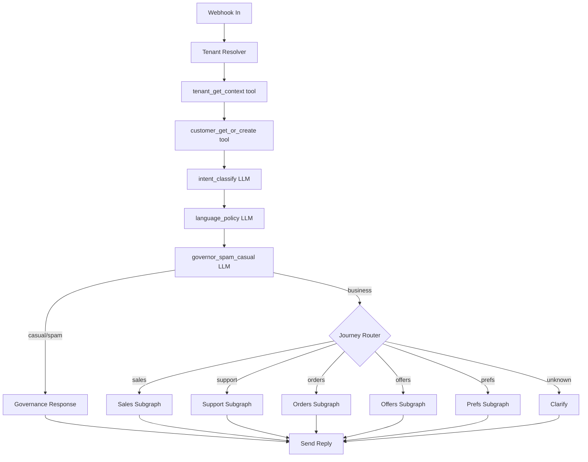
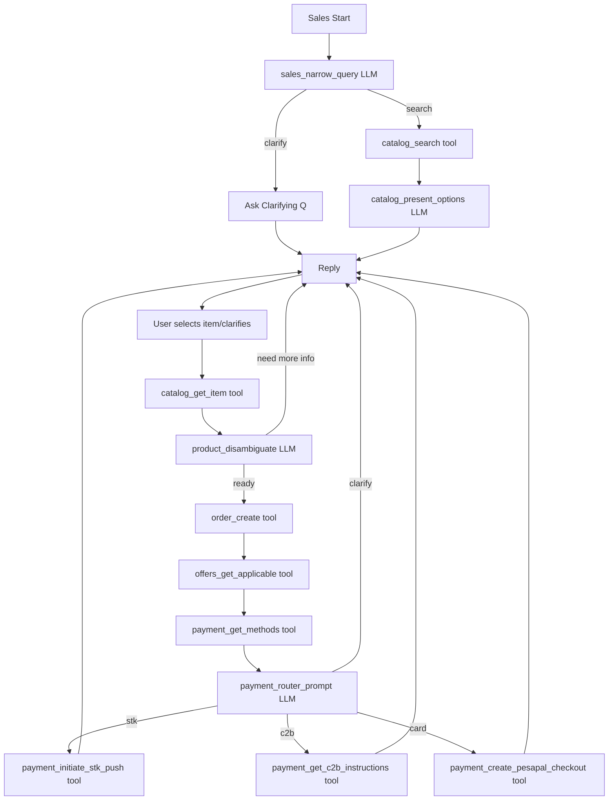
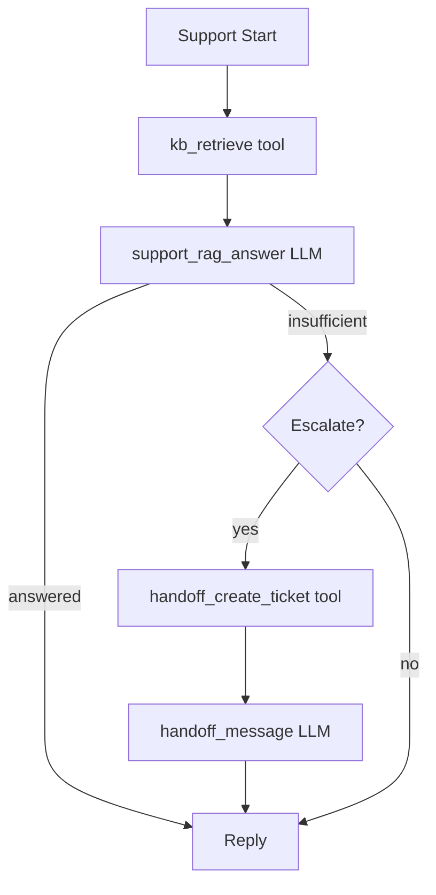
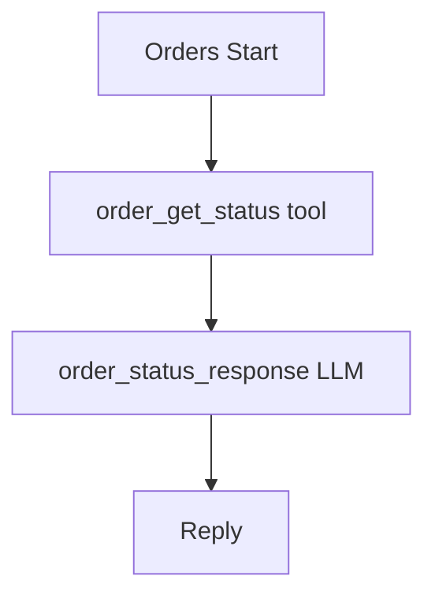
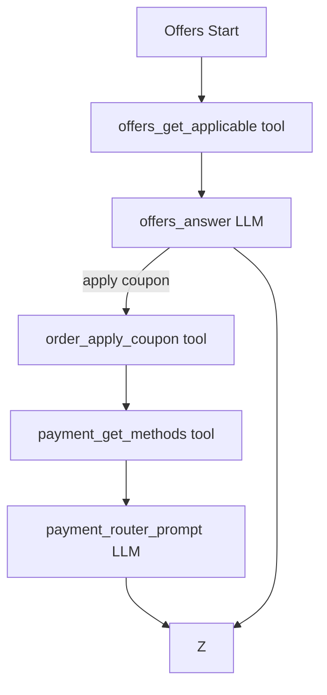

# Tulia AI V2 — Kiro Rebuild README (Authoritative Spec)
**Purpose:** Provide Kiro with a zero-ambiguity blueprint to rebuild Tulia AI from scratch as a **tenant-scoped WhatsApp Sales + Support commerce agent**, using **LangChain + LangGraph + Tool-first execution + Tenant-scoped RAG**, with strict privacy/consent controls and predictable autonomy.

**Backward compatibility:** NOT required. Remove legacy direct LLM calling patterns.

**Target launch:** Mid-January (soft launch + pilots).

---

## 1) Product Definition (What We Are Building)

Tulia AI is a **WhatsApp Sales & Support Agent** for SMEs/tenants that:
- Converts chat into **orders and payments** (primary value driver).
- Handles **support questions** grounded in tenant data (RAG).
- Supports **order enquiries**, **offers/coupons**, and **preferences/consent**.
- Uses **human handoff only when necessary**.
- Enforces **tenant-scoped privacy** (customer identity is per tenant).

---

## 2) Non-Negotiables (Hard Rules)

### 2.1 This is NOT a prompt-driven chatbot
Do **not** implement `message -> prompt -> LLM -> response` as the system backbone.

### 2.2 LangGraph orchestrates everything
Every inbound message enters a **LangGraph state machine** with explicit state and routing.

### 2.3 Tool-first execution (LLM cannot invent truth)
The LLM may only:
- classify intent/language/governance
- ask clarifying questions
- call tools
- summarize tool outputs

The LLM must **never** invent:
- prices, discounts, offers
- stock/availability
- delivery timelines/ETAs
- payment outcomes/status
- order data

### 2.4 Tenant isolation is architectural (not prompt-based)
Mandatory scoping:
- Customer identity = `(tenant_id, phone_e164)`
- Vector DB namespaces = tenant-scoped
- Memory = tenant-scoped
- Tools always require `tenant_id`

### 2.5 Consent and privacy are enforced
- Marketing messages require opt-in (tenant-configurable but default to strict).
- Opt-out keywords (STOP/UNSUBSCRIBE) must be immediate and auditable.
- Avoid storing sensitive content in vector memory; store minimal, structured metadata.

---

## 3) Canonical LangGraph State (Reference Class)

### 3.1 State shape (single source of truth)
> If it is not in state, the agent does not “know” it.

```python
from dataclasses import dataclass, field
from typing import Any, Dict, List, Optional, Literal

Intent = Literal[
  "sales_discovery", "product_question", "support_question", "order_status",
  "discounts_offers", "preferences_consent", "payment_help",
  "human_request", "spam_casual", "unknown"
]

Journey = Literal["sales", "support", "orders", "offers", "prefs", "governance", "unknown"]

Lang = Literal["en", "sw", "sheng", "mixed"]

GovernorClass = Literal["business", "casual", "spam", "abuse"]

@dataclass
class ConversationState:
    # Identity & scoping
    tenant_id: str
    conversation_id: str
    request_id: str
    customer_id: Optional[str] = None
    phone_e164: Optional[str] = None  # only when needed for STK

    # Tenant context
    tenant_name: Optional[str] = None
    bot_name: Optional[str] = None
    bot_intro: Optional[str] = None
    tone_style: str = "friendly_concise"
    default_language: Lang = "en"
    allowed_languages: List[str] = field(default_factory=lambda: ["en", "sw", "sheng"])
    max_chattiness_level: int = 2  # 0..3 recommended
    catalog_link_base: Optional[str] = None
    payments_enabled: Dict[str, bool] = field(default_factory=dict)
    compliance: Dict[str, Any] = field(default_factory=dict)
    handoff: Dict[str, Any] = field(default_factory=dict)

    # Customer preferences / consent
    customer_language_pref: Optional[Lang] = None
    marketing_opt_in: Optional[bool] = None
    notification_prefs: Dict[str, bool] = field(default_factory=dict)

    # Classifiers
    intent: Intent = "unknown"
    intent_confidence: float = 0.0
    journey: Journey = "unknown"

    response_language: Lang = "en"
    language_confidence: float = 0.0

    governor_classification: GovernorClass = "business"
    governor_confidence: float = 0.0

    # Catalog selection & ordering
    last_catalog_query: Optional[str] = None
    last_catalog_filters: Dict[str, Any] = field(default_factory=dict)
    last_catalog_results: List[Dict[str, Any]] = field(default_factory=list)
    catalog_total_matches_estimate: Optional[int] = None
    selected_item_ids: List[str] = field(default_factory=list)

    cart: List[Dict[str, Any]] = field(default_factory=list)  # [{item_id, qty, variant_selection}]
    order_id: Optional[str] = None
    order_totals: Dict[str, Any] = field(default_factory=dict)
    payment_request_id: Optional[str] = None
    payment_status: Optional[str] = None  # pending/paid/failed/unknown

    # Retrieval context (RAG)
    kb_snippets: List[Dict[str, Any]] = field(default_factory=list)

    # Safety / escalation
    escalation_required: bool = False
    escalation_reason: Optional[str] = None
    handoff_ticket_id: Optional[str] = None

    # Conversation controls
    turn_count: int = 0
    casual_turns: int = 0
    spam_turns: int = 0

    # Output
    response_text: Optional[str] = None
```

---

## 4) Exact Routing Conditions (Zero Ambiguity)

### 4.1 Intent routing thresholds
- If `intent_confidence >= 0.70`: route to `suggested_journey`.
- If `0.50 <= intent_confidence < 0.70`: ask **one** clarifying question, then re-classify.
- If `< 0.50`: route to `unknown` handler (clarify what they want: buy / support / order / offers / preferences).

### 4.2 Language policy thresholds
- If language classifier `confidence >= 0.75`: set `response_language` accordingly **ONLY IF** language is allowed by tenant.
- If `< 0.75`: set `response_language = tenant.default_language`.
- If user explicitly requests language (“kiswahili please”): override to that language if allowed.

### 4.3 Conversation governor thresholds (business vs casual/spam)
- If classification == `business`: proceed.
- If classification == `casual`:
  - increment `casual_turns += 1`
  - allow **max 2 casual turns** (see chattiness rules) before redirecting to business capability.
- If classification == `spam`:
  - increment `spam_turns += 1`
  - after `spam_turns >= 2`: respond minimally and stop engaging; offer help options.
- If classification == `abuse`: stop or escalate (tenant policy). Default: refuse politely and end.

### 4.4 When to show catalog link
Show catalog link (web fallback) when ANY is true:
- `catalog_total_matches_estimate >= 50` and user still vague after 1 clarifying question
- user asks to “see all items / catalog / list everything”
- results are low confidence (no clear top 3)
- product selection requires visuals/variants beyond WhatsApp UX (tenant-configurable)
- repeated loop: user rejects 2 shortlists in a row

**WhatsApp shortlist rule:** never show more than **6** items in a single reply.

### 4.5 When to escalate to human handoff
Escalate immediately if ANY is true:
- user explicitly asks for human (“agent”, “human”, “call me”)
- payment disputes (“I paid but…”), chargebacks, refunds, delivery complaints beyond policy
- missing authoritative info after RAG/tool attempts (e.g., unclear order lookup)
- repeated failures: 2 consecutive tool errors or 3 clarification loops
- sensitive/legal/medical content (tenant policy)
- user frustration detected + failure to resolve in 2 turns

### 4.6 Chattiness limits (cost + professionalism)
Define `max_chattiness_level` (0–3) per tenant:
- 0: strictly business only (no small talk)
- 1: minimal friendliness (1 short greeting)
- 2: friendly but bounded (default) — allow at most **2** casual turns per conversation
- 3: more friendly — allow at most **4** casual turns, but still enforce redirect

Hard rule: if `casual_turns` exceeds the allowed threshold, respond with:
- a brief acknowledgement
- a business re-anchor (“I can help with products, orders, payments, offers, and support.”)
- a single choice menu

---

## 5) Tool Schemas (Function Calling Contracts)

### 5.1 Tool conventions
- All tools require: `tenant_id`, `request_id`, `conversation_id`
- Customer-scoped tools require `customer_id` (or `phone_e164` only when needed)
- Tools return structured JSON truth; do not return prose

### 5.2 Tools list (implement exactly)
- `tenant_get_context`
- `customer_get_or_create`
- `customer_update_preferences`
- `catalog_search`
- `catalog_get_item`
- `order_create`
- `offers_get_applicable`
- `order_apply_coupon`
- `payment_get_methods`
- `payment_get_c2b_instructions`
- `payment_initiate_stk_push`
- `payment_create_pesapal_checkout`
- `order_get_status`
- `kb_retrieve`
- `handoff_create_ticket`

> The exact JSON Schemas for each tool are included in this README’s Appendix A (below).

---

## 6) Node Prompts (Exact Templates)

### 6.1 Global system prompt (used by all LLM nodes)
**SYSTEM_BASE**
- You are {bot_name}, {bot_intro}.  
- You serve ONLY tenant: {tenant_name} (tenant_id={tenant_id}).  
- Rules:
  1) Never invent prices/discounts/stock/delivery/order/payment facts. Use tools or ask clarifying questions.  
  2) Tenant isolation is mandatory.  
  3) Payments/orders require confirmations.  
  4) Respect consent (opt-out immediately).  
  5) Language: respond in {response_language}; if uncertain use {default_language}.  
  6) Tone: {tone_style}. Keep messages concise and actionable. Avoid long casual chat.  
  7) Escalate if unsafe/uncertain.  

### 6.2 LLM nodes (must output JSON where specified)
- `intent_classify` (JSON output)
- `language_policy` (JSON output)
- `governor_spam_casual` (JSON output)
- `sales_narrow_query` (JSON output: search or clarify)
- `catalog_present_options` (text output)
- `product_disambiguate` (text output)
- `support_rag_answer` (text output)
- `offers_answer` (text output)
- `payment_router_prompt` (JSON output)
- `order_status_response` (text output)
- `prefs_consent_response` (text output)
- `handoff_message` (text output)

> The exact prompt text for each node is included in Appendix B (below).

---

## 7) LangGraph Diagrams (Mermaid)

### 7.1 Top-level orchestrator


### 7.2 Sales, Support, Orders, Offers, Prefs subgraphs
Included in Appendix C (below).

---

## 8) January Launch Checklist (Mid-January)

### 8.1 Product readiness (must-have)
- Sales journey completes end-to-end: discovery → selection → order → payment initiation
- Order enquiry: “Where is my order?” returns correct status (tool truth)
- Support RAG: answers grounded; refuses + escalates when missing
- Offers: only real offers/coupons; no invention
- Consent: STOP/UNSUBSCRIBE immediately opts out and confirms
- Language policy stable: default English unless confident or requested
- Governor: redirects casual chat; disengages from spam

### 8.2 Payment readiness (Kenya realism)
- STK success/failure/timeout handled with correct messaging
- C2B instructions include correct reference per order
- PesaPal checkout link generated and tracked
- User can ask “did it go through?” → tool lookup or explain pending

### 8.3 Tenant onboarding (minimum)
- Tenant can set bot name/tone/language
- Tenant can upload docs (PDF/DOCX/text) to KB
- Tenant can add products/services (manual or import)
- Tenant can configure payment methods

### 8.4 Reliability / observability
- Structured logs include tenant_id, conversation_id, request_id, node, tool, latency
- Tool errors handled safely (no crashes; user guidance)
- Rate limiting per tenant and per customer
- Token/cost logging per node (approx acceptable)
- Cross-tenant leakage tests pass

### 8.5 Go / No-Go gates
Do not pilot externally unless:
- Order + payment initiation works autonomously
- Opt-out works immediately
- No cross-tenant leakage under tests
- Payment instructions are always correct

---

## Appendix A — Tool Schemas (Full)
(Include the full JSON Schema blocks from the prior message: tenant_get_context, customer_get_or_create, customer_update_preferences, catalog_search, catalog_get_item, order_create, offers_get_applicable, order_apply_coupon, payment_get_methods, payment_get_c2b_instructions, payment_initiate_stk_push, payment_create_pesapal_checkout, order_get_status, kb_retrieve, handoff_create_ticket.)

> Implementation note: Kiro must paste these into the function/tool registry exactly and validate inputs/outputs.

---

## Appendix B — Node Prompts (Full)
(Include the full prompt templates from the prior message for each node, unchanged.)

---

## Appendix C — Subgraph Diagrams (Full)
(Include Sales, Support, Orders, Offers, Prefs Mermaid diagrams from the prior message.)

---

## Implementation Notes for Kiro (Strict)
- All inbound messages must load tenant + customer first.
- All LLM nodes that specify JSON must be parsed and validated; on parse failure: retry once with “return valid JSON only”, else fallback to clarification.
- Use short, WhatsApp-friendly responses.
- Never output more than 6 catalog items.
- Do not store raw user messages in vector DB; store structured summaries if needed and tenant-approved.
- Build in safe defaults: English default, strict opt-in, conservative escalation.

---

## Done Definition
The rebuild is complete when Tulia AI can:
- complete an order and start payment without human involvement
- answer support using tenant KB without hallucinating
- respect consent and preferences
- handle large catalogs via narrowing + catalog link fallback
- remain tenant-isolated in all data paths

### Appendix A — Tool Schemas (Full)

#### Tool: tenant_get_context
```json
{
  "name": "tenant_get_context",
  "description": "Fetch tenant configuration, bot persona, enabled capabilities, and safety limits.",
  "parameters": {
    "type": "object",
    "properties": {
      "tenant_id": { "type": "string" },
      "request_id": { "type": "string" },
      "conversation_id": { "type": "string" }
    },
    "required": ["tenant_id", "request_id", "conversation_id"],
    "additionalProperties": false
  }
}
```

#### Tool: customer_get_or_create
```json
{
  "name": "customer_get_or_create",
  "description": "Get or create a tenant-scoped customer profile using phone number. Returns preferences and consent flags.",
  "parameters": {
    "type": "object",
    "properties": {
      "tenant_id": { "type": "string" },
      "request_id": { "type": "string" },
      "conversation_id": { "type": "string" },
      "phone_e164": { "type": "string", "description": "Customer phone in E.164 format." },
      "display_name": { "type": "string" }
    },
    "required": ["tenant_id", "request_id", "conversation_id", "phone_e164"],
    "additionalProperties": false
  }
}
```

#### Tool: customer_update_preferences
```json
{
  "name": "customer_update_preferences",
  "description": "Update a tenant-scoped customer's preferences and consent. Stores an auditable consent event when applicable.",
  "parameters": {
    "type": "object",
    "properties": {
      "tenant_id": { "type": "string" },
      "request_id": { "type": "string" },
      "conversation_id": { "type": "string" },
      "customer_id": { "type": "string" },
      "updates": {
        "type": "object",
        "properties": {
          "language_preference": { "type": "string", "enum": ["en", "sw", "sheng", "mixed"] },
          "marketing_opt_in": { "type": "boolean" },
          "offers_whatsapp": { "type": "boolean" },
          "order_updates_whatsapp": { "type": "boolean" }
        },
        "additionalProperties": false
      },
      "consent_source": { "type": "string", "enum": ["user_message", "admin", "import"] }
    },
    "required": ["tenant_id", "request_id", "conversation_id", "customer_id", "updates", "consent_source"],
    "additionalProperties": false
  }
}
```

#### Tool: catalog_search
```json
{
  "name": "catalog_search",
  "description": "Search tenant catalog (products/services). Supports semantic query and structured filters.",
  "parameters": {
    "type": "object",
    "properties": {
      "tenant_id": { "type": "string" },
      "request_id": { "type": "string" },
      "conversation_id": { "type": "string" },
      "query": { "type": "string" },
      "filters": {
        "type": "object",
        "properties": {
          "type": { "type": "string", "enum": ["product", "service", "any"] },
          "category": { "type": "string" },
          "min_price": { "type": "number" },
          "max_price": { "type": "number" },
          "tags": { "type": "array", "items": { "type": "string" } },
          "in_stock_only": { "type": "boolean" }
        },
        "additionalProperties": false
      },
      "limit": { "type": "integer", "minimum": 1, "maximum": 10 }
    },
    "required": ["tenant_id", "request_id", "conversation_id", "query", "limit"],
    "additionalProperties": false
  }
}
```

#### Tool: catalog_get_item
```json
{
  "name": "catalog_get_item",
  "description": "Fetch authoritative details for one product/service item.",
  "parameters": {
    "type": "object",
    "properties": {
      "tenant_id": { "type": "string" },
      "request_id": { "type": "string" },
      "conversation_id": { "type": "string" },
      "item_id": { "type": "string" }
    },
    "required": ["tenant_id", "request_id", "conversation_id", "item_id"],
    "additionalProperties": false
  }
}
```

#### Tool: order_create
```json
{
  "name": "order_create",
  "description": "Create an order draft from selected catalog items. Returns totals and next required fields.",
  "parameters": {
    "type": "object",
    "properties": {
      "tenant_id": { "type": "string" },
      "request_id": { "type": "string" },
      "conversation_id": { "type": "string" },
      "customer_id": { "type": "string" },
      "items": {
        "type": "array",
        "items": {
          "type": "object",
          "properties": {
            "item_id": { "type": "string" },
            "quantity": { "type": "integer", "minimum": 1 },
            "variant_selection": { "type": "object", "additionalProperties": { "type": "string" } }
          },
          "required": ["item_id", "quantity"],
          "additionalProperties": false
        }
      },
      "delivery": {
        "type": "object",
        "properties": {
          "mode": { "type": "string", "enum": ["pickup", "delivery", "digital"] },
          "address_text": { "type": "string" },
          "location_hint": { "type": "string" }
        },
        "additionalProperties": false
      },
      "notes": { "type": "string" }
    },
    "required": ["tenant_id", "request_id", "conversation_id", "customer_id", "items"],
    "additionalProperties": false
  }
}
```

#### Tool: offers_get_applicable
```json
{
  "name": "offers_get_applicable",
  "description": "Fetch applicable offers/coupons for a customer and/or order. Returns eligibility and terms.",
  "parameters": {
    "type": "object",
    "properties": {
      "tenant_id": { "type": "string" },
      "request_id": { "type": "string" },
      "conversation_id": { "type": "string" },
      "customer_id": { "type": "string" },
      "order_id": { "type": "string" }
    },
    "required": ["tenant_id", "request_id", "conversation_id", "customer_id"],
    "additionalProperties": false
  }
}
```

#### Tool: order_apply_coupon
```json
{
  "name": "order_apply_coupon",
  "description": "Apply a coupon code to an order and return updated totals.",
  "parameters": {
    "type": "object",
    "properties": {
      "tenant_id": { "type": "string" },
      "request_id": { "type": "string" },
      "conversation_id": { "type": "string" },
      "customer_id": { "type": "string" },
      "order_id": { "type": "string" },
      "coupon_code": { "type": "string" }
    },
    "required": ["tenant_id", "request_id", "conversation_id", "customer_id", "order_id", "coupon_code"],
    "additionalProperties": false
  }
}
```

#### Tool: payment_get_methods
```json
{
  "name": "payment_get_methods",
  "description": "Get enabled payment methods for a tenant and order context.",
  "parameters": {
    "type": "object",
    "properties": {
      "tenant_id": { "type": "string" },
      "request_id": { "type": "string" },
      "conversation_id": { "type": "string" },
      "order_id": { "type": "string" }
    },
    "required": ["tenant_id", "request_id", "conversation_id", "order_id"],
    "additionalProperties": false
  }
}
```

#### Tool: payment_get_c2b_instructions
```json
{
  "name": "payment_get_c2b_instructions",
  "description": "Generate MPESA C2B payment instructions for the order (paybill/till + account/reference).",
  "parameters": {
    "type": "object",
    "properties": {
      "tenant_id": { "type": "string" },
      "request_id": { "type": "string" },
      "conversation_id": { "type": "string" },
      "order_id": { "type": "string" }
    },
    "required": ["tenant_id", "request_id", "conversation_id", "order_id"],
    "additionalProperties": false
  }
}
```

#### Tool: payment_initiate_stk_push
```json
{
  "name": "payment_initiate_stk_push",
  "description": "Initiate MPESA STK push for an order. Returns a payment_request_id and next steps.",
  "parameters": {
    "type": "object",
    "properties": {
      "tenant_id": { "type": "string" },
      "request_id": { "type": "string" },
      "conversation_id": { "type": "string" },
      "order_id": { "type": "string" },
      "phone_e164": { "type": "string" },
      "amount": { "type": "number" }
    },
    "required": ["tenant_id", "request_id", "conversation_id", "order_id", "phone_e164", "amount"],
    "additionalProperties": false
  }
}
```

#### Tool: payment_create_pesapal_checkout
```json
{
  "name": "payment_create_pesapal_checkout",
  "description": "Create a PesaPal hosted checkout URL for an order.",
  "parameters": {
    "type": "object",
    "properties": {
      "tenant_id": { "type": "string" },
      "request_id": { "type": "string" },
      "conversation_id": { "type": "string" },
      "order_id": { "type": "string" }
    },
    "required": ["tenant_id", "request_id", "conversation_id", "order_id"],
    "additionalProperties": false
  }
}
```

#### Tool: order_get_status
```json
{
  "name": "order_get_status",
  "description": "Fetch order status, payment status, and fulfillment timeline for a customer.",
  "parameters": {
    "type": "object",
    "properties": {
      "tenant_id": { "type": "string" },
      "request_id": { "type": "string" },
      "conversation_id": { "type": "string" },
      "customer_id": { "type": "string" },
      "order_ref": { "type": "string" }
    },
    "required": ["tenant_id", "request_id", "conversation_id", "customer_id"],
    "additionalProperties": false
  }
}
```

#### Tool: kb_retrieve
```json
{
  "name": "kb_retrieve",
  "description": "Retrieve relevant tenant knowledge base snippets (tenant-scoped vector search).",
  "parameters": {
    "type": "object",
    "properties": {
      "tenant_id": { "type": "string" },
      "request_id": { "type": "string" },
      "conversation_id": { "type": "string" },
      "query": { "type": "string" },
      "top_k": { "type": "integer", "minimum": 1, "maximum": 8 },
      "source_types": {
        "type": "array",
        "items": { "type": "string", "enum": ["policy", "faq", "doc", "sop"] }
      }
    },
    "required": ["tenant_id", "request_id", "conversation_id", "query", "top_k"],
    "additionalProperties": false
  }
}
```

#### Tool: handoff_create_ticket
```json
{
  "name": "handoff_create_ticket",
  "description": "Create a human handoff ticket with full context snapshot (tenant-scoped).",
  "parameters": {
    "type": "object",
    "properties": {
      "tenant_id": { "type": "string" },
      "request_id": { "type": "string" },
      "conversation_id": { "type": "string" },
      "customer_id": { "type": "string" },
      "reason": { "type": "string" },
      "priority": { "type": "string", "enum": ["low", "normal", "high", "urgent"] },
      "context_snapshot": { "type": "object", "additionalProperties": true }
    },
    "required": ["tenant_id", "request_id", "conversation_id", "customer_id", "reason", "priority", "context_snapshot"],
    "additionalProperties": false
  }
}
```

### Appendix B — Node Prompts (Full)

#### Node: intent_classify (JSON output)
> Classify the user message into ONE primary intent from this list:  
> - sales_discovery  
> - product_question  
> - support_question  
> - order_status  
> - discounts_offers  
> - preferences_consent  
> - payment_help  
> - human_request  
> - spam_casual  
> - unknown  
>
> Return JSON only with fields:  
> `{ "intent": "...", "confidence": 0-1, "notes": "short", "suggested_journey": "sales|support|orders|offers|prefs|governance" }`  
>
> User message: {user_message}

#### Node: language_policy (JSON output)
> Decide response language. Constraints:
> - Allowed: {allowed_languages}
> - Default: {default_language}
> - Customer preference (if set): {customer_language_pref}
> - If confidence < 0.75, choose default_language.
>
> Return JSON only:  
> `{ "response_language": "en|sw|sheng|mixed", "confidence": 0-1, "should_ask_language_question": true|false }`
>
> User message: {user_message}

#### Node: governor_spam_casual (JSON output)
> Determine if this conversation is business-relevant or casual/spam.  
> Business-relevant means: buying, product/service enquiry, order, payment, support, offers, preferences.  
> Casual/spam means: greetings loops, jokes, flirting, time-wasting, repeated nonsense, abusive language.
>
> Return JSON only:  
> `{ "classification": "business|casual|spam|abuse", "confidence": 0-1, "recommended_action": "proceed|redirect|limit|stop|handoff" }`
>
> Recent messages summary: {recent_summary}  
> Current user message: {user_message}

#### Node: sales_narrow_query (JSON output)
> Build a catalog search request to find the most relevant products/services.  
> Constraints:
> - Keep limit to 6.
> - If user is vague, ask ONE clarifying question instead of searching.
>
> Return JSON only in one of two forms:
> 1) Search:
> `{ "action": "search", "query": "...", "filters": { "type":"product|service|any", "category":"...", "min_price":null, "max_price":null, "tags":[] }, "limit": 6 }`
> 2) Clarify:
> `{ "action": "clarify", "question": "single question to narrow down", "options": ["optional short options"] }`
>
> User message: {user_message}

#### Node: catalog_present_options (text output)
> Create a WhatsApp-friendly shortlist from these results (max 6).  
> Include: numbered list, name, price, 1-line differentiator.  
> End with: "Reply with the number (1-6) or tell me your budget/use-case."  
> If total_matches_estimate is large and results uncertain, suggest the catalog link.
>
> Catalog results JSON: {catalog_results_json}  
> Catalog link base: {catalog_link_base}

#### Node: product_disambiguate (text output)
> We are confirming a selected item for an order.  
> Ask ONLY for missing fields needed to proceed (quantity, variant, delivery mode).  
> If user is ready, restate: item + qty + total estimate (from tool totals if available).
>
> Current state: {state_json}  
> Selected item details: {item_json}

#### Node: support_rag_answer (text output)
> Answer the question using ONLY the provided snippets.  
> If the answer is not in the snippets, say you don’t have that information and offer:  
> - ask a clarifying question OR  
> - escalate to human support.
>
> Provide a short answer and (if helpful) 1–3 bullet steps.  
> Do not mention “snippets” or “RAG”.
>
> Question: {user_message}  
> Snippets: {snippets_json}

#### Node: offers_answer (text output)
> Explain applicable offers clearly and briefly.  
> Never invent offers. Use only tool output.  
> If user asked for a coupon code, prompt them to share code or confirm applying the best eligible offer.
>
> Offers JSON: {offers_json}  
> User message: {user_message}

#### Node: payment_router_prompt (JSON output)
> Choose next payment step based on enabled methods and user preference.  
> Rules:
> - Confirm amount and order before initiating any payment.
> - If user wants STK, request phone confirmation if needed.
> - If user wants C2B, provide exact instructions.
> - If user wants card, provide hosted checkout link.
>
> Return JSON only:
> `{ "next_action": "stk|c2b|card|clarify", "confirmation_needed": ["..."], "message_to_user": "..." }`
>
> Enabled methods: {methods_json}  
> Order totals: {order_totals_json}  
> User message: {user_message}

#### Node: order_status_response (text output)
> Summarize the order status in 3–6 lines.  
> Include: order ref, payment status, fulfillment status, ETA.  
> If multiple orders, ask which one (by ref + date).  
> Do not invent.
>
> Orders JSON: {orders_json}  
> User message: {user_message}

#### Node: prefs_consent_response (text output)
> Confirm the customer’s updated preferences clearly.  
> If opted out, reassure: no more offers.  
> If opted in, clarify what they will receive and how to opt out anytime.
>
> Updated customer JSON: {customer_json}

#### Node: handoff_message (text output)
> Inform the customer that you’re escalating to a human agent.  
> Keep it short, polite, and include expected response time if available.  
> Do not blame the customer.
>
> Ticket JSON: {ticket_json}

### Appendix C — Subgraph Diagrams (Full)

#### Sales Journey


#### Support Journey (RAG)


#### Orders Journey


#### Offers/Coupons Journey


#### Preferences & Consent Journey
```mermaid
flowchart TD
  R0[Prefs Start] --> R1[Parse preference intent (LLM or rules)]
  R1 --> R2[customer_update_preferences tool]
  R2 --> R3[prefs_consent_response LLM]
  R3 --> Z[Reply]
```
